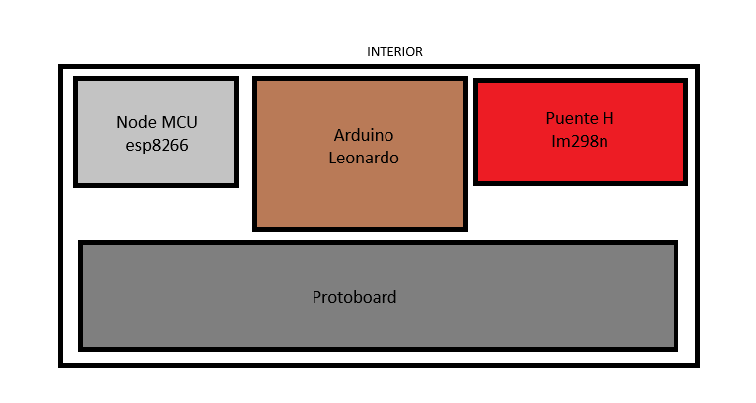
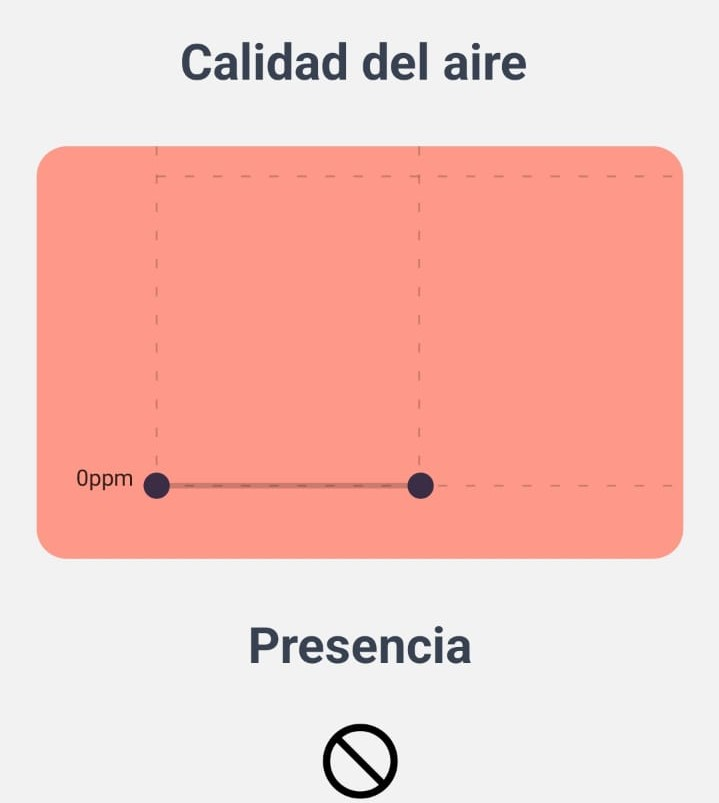
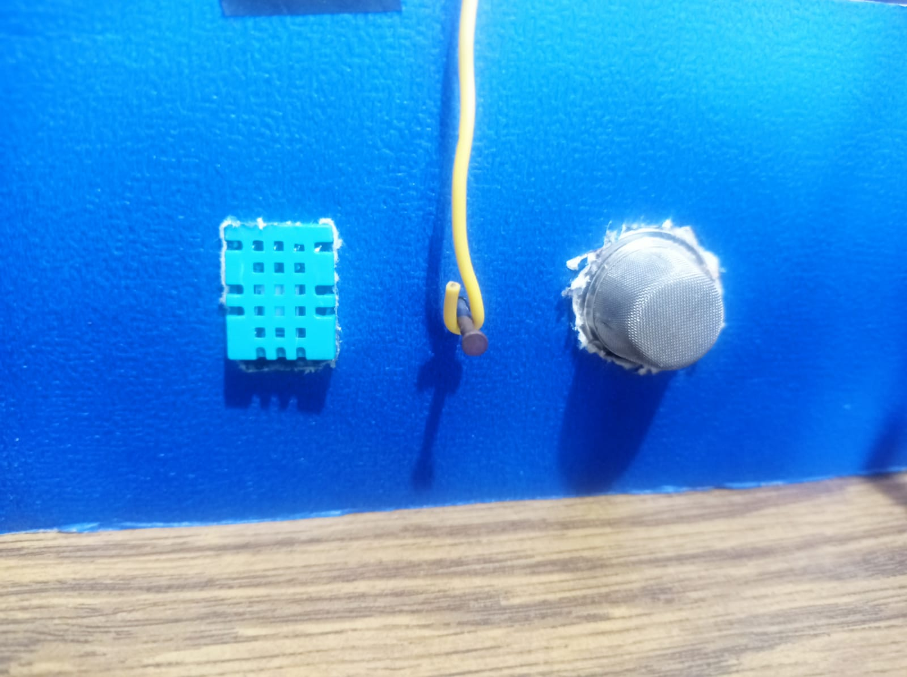
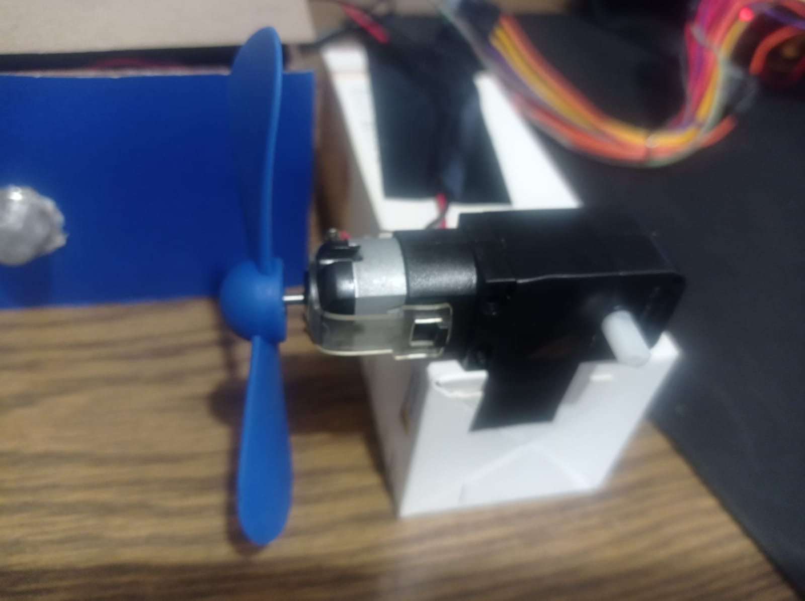
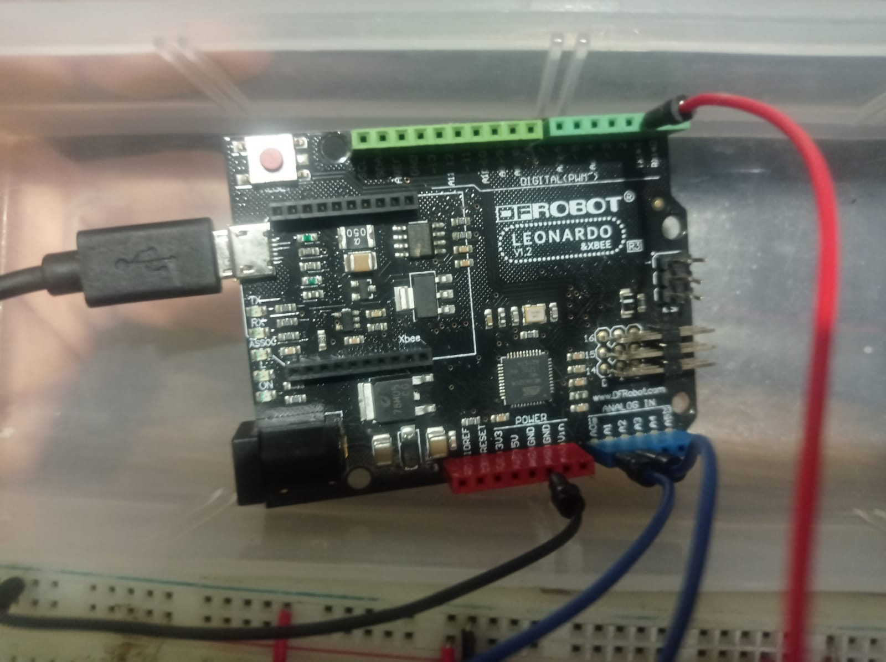
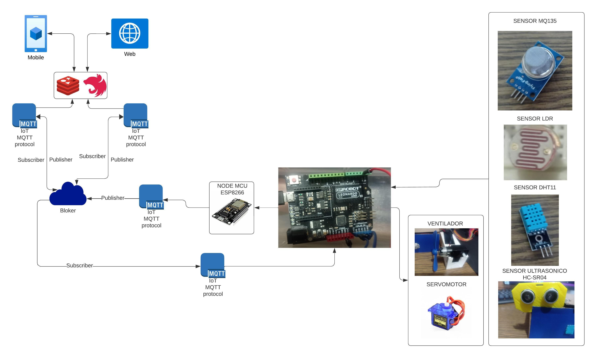
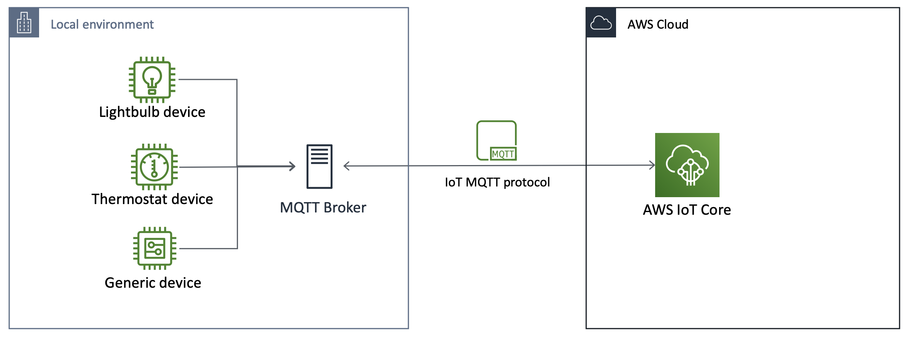
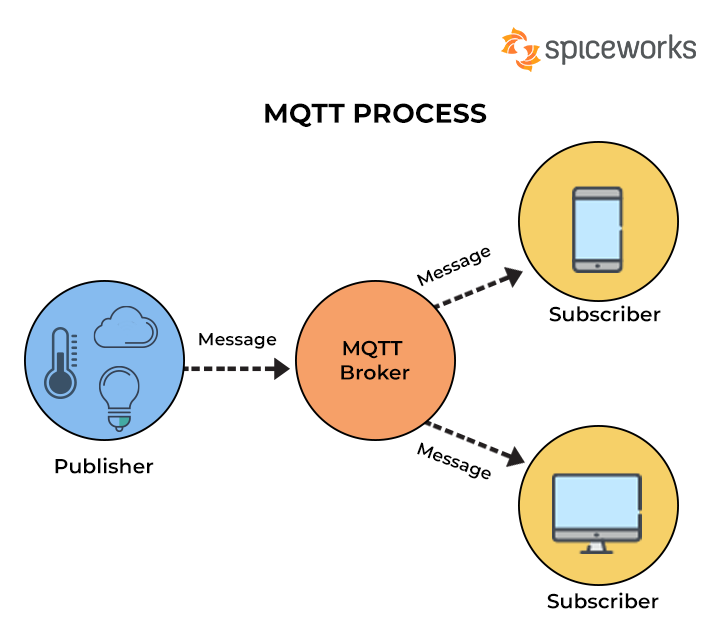
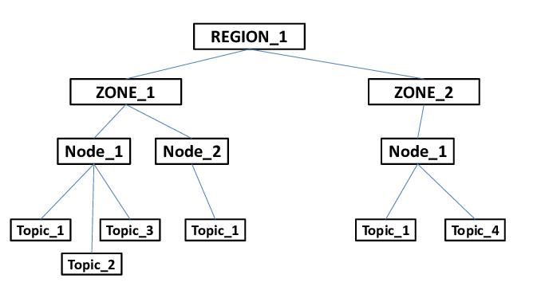

# <center> PRÁCTICA NO. 2 </center>

# DESCRIPCIÓN 
Una estación meteorológica de Internet de las cosas (IoT) representa un sistema avanzado de seguimiento que incorpora una variedad de sensores para adquirir información en tiempo real acerca de las condiciones climáticas. Es por eso que se creado un dispositivo diseñado específicamente para recolectar datos sobre las cuatro variables principales, que son la temperatura, la luminosidad y la concentración de dióxido de carbono (CO2) en el aire. Este dispositivo reúne la información proveniente de los sensores y la transmite a una plataforma en donde los datos se registran a través una base de datos y pueden ser visualizados por medio de una aplicación web y una aplicación móvil. Esto brinda la posibilidad a los usuarios de supervisar y tomar medidas con relación a los diversos elementos que son gestionados por la estación.


## Funcionamiento : 

La estación meteorológica cumple con distintas funciones principales como la medición de la temperatura, identificar la calidad de luz en el ambiente, la medición de la calidad del aire, la medición de proximidad, la conexión inalámbrica y la activación de actuadores. 

El dispositivo tiene la capacidad de evaluar la temperatura del entorno en el que se encuentra y ofrecer información precisa sobre los cambios de temperatura que están ocurriendo en ese momento, así como también incorpora sensores que detectan la calidad de la luz ambiental, miden la cantidad de CO2 del ambiente para determinar la calidad del aire, reconoce la proximidad de un objeto o persona con la finalidad de comprobar la ausencia o presencia de dicho objetivo en el lugar. 

Este dispositivo cuenta con un sistema que permite una conexión completamente inalámbrica por medio de un componente wifi el cual funciona como interfaz entre el Arduino y la base de datos. Este sistema también proporciona la opción de involucrase con cualquiera de los diferentes actuadores que se encuentren disponibles.  


## Usos :

Esta estación meteorológica recopila información de los sensores incorporados y los transmite a través de Internet hacia una plataforma centralizada utilizando técnicas como las colas de mensajes. Estos datos se almacenan y son accesibles mediante una aplicación web y una aplicación móvil, lo que permite a los usuarios supervisar en tiempo real las condiciones climáticas en un entorno específico o realizar un seguimiento de las tendencias a lo largo del tiempo.

La aplicación móvil funciona a través de una interfaz gráfica amigable que contiene información sobre el sistema de seguridad y el sistema de ventilación, con el objetivo de que el usuario pueda visualizar cada uno de los datos que se recopilación de los cambios que los sensores del dispositivo lograron detectar en la temperatura, en la calidad de aire y si lograron realizar la medición de proximidad. La aplicación web también cuenta con una interfaz grafica en la que se pueden visualizar las gráficas de la temperatura de la habitación, de la presencia humana, de la iluminación y de la calidad del aire. 

## Beneficios :

El sistema es administra un entorno inteligente dentro de una habitación o en un lugar en específico, garantizando que las condiciones sean saludables para la persona que lo ocupa asi como también otros beneficios como: 

- El sistema proporciona mediciones precisas de las condiciones climáticas en tiempo real, lo que es esencial para la toma de decisiones informadas.

- Permite la detección de cambios significativos en la temperatura, la luz o la concentración de CO2, lo que puede ayudar a prevenir problemas o tomar medidas preventivas.

- Ayuda a optimizar el uso de energía al analizar la iluminación y la temperatura, lo que puede conducir a un ahorro significativo de costos energéticos.

- Contribuye a crear un entorno saludable y cómodo para los ocupantes al controlar la temperatura y la calidad del aire, lo que puede mejorar la productividad y el bienestar.

- Permite a los usuarios supervisar y controlar el entorno desde cualquier lugar a través de aplicaciones web y móviles, lo que brinda comodidad y flexibilidad.

- Los datos recopilados pueden ser valiosos para la investigación científica y la comprensión de los patrones climáticos locales.


## Impacto Ambiental : 

Una estación meteorológica de IoT que monitorea e integra diversos sensores para recopilar datos climáticos en tiempo real en realidad tiene un impacto ambiental positivo. Estas estaciones a menudo están diseñadas para ser altamente eficientes en términos de consumo de energía. Esto significa que requieren una cantidad mínima de energía para funcionar, lo que reduce su huella de carbono. Como permiten un monitoreo más preciso del clima y la calidad del aire, estas estaciones pueden ayudar a optimizar el uso de recursos como la calefacción, la refrigeración y la iluminación en edificios y espacios, lo que también conduce a un menor consumo de energía. 

Al recopilar datos sobre la concentración de CO2 en el aire, este dispositivo contribuye a la conciencia sobre la calidad del aire y la importancia de reducir las emisiones de gases de efecto invernadero, lo que promueve prácticas más sostenibles. Estos datos también son valiosos para la investigación científica y pueden contribuir al entendimiento y la mitigación del cambio climático y otros fenómenos ambientales ya que, al monitorear las condiciones climáticas en tiempo real, se puede predecir y preparar para eventos climáticos extremos, lo que puede reducir el impacto de desastres naturales en el medio ambiente.

___

## BOCETOS DEL PROTOTIPO


Boceto del Prototipo por fuera. 



Boceto del Prototipo por dentro. 
___

## PROTOTIPO PROPUESTO


Imagen del prototipo por fuera. 


Imagen del prototipo por dentro. 


Imagen de la fuente de poder del computador para alimentacion externa. 

___

## MOCK-UP DE LA APLICACION MOVIL

La aplicacion movil cuenta con 3 pantallas, las cuales son parte esencial del dispositivo IoT y se puede acceder a ella por medio de una barra de navegacion que se encuentra en la parte inferior de la pantalla, de este modo, es importante profundizar en las diversas pantallas que ofrece en conjunto con sus funcionalidades, caracteristicas y diseño.


Barra de navegacion ubicado en parte inferior de aplicacion movil


## Monitor de sensores
La primera pantalla de la aplicacion movil denominada monitor de sensores consta de tres graficos los cuales dan una representacion histórica de los valores que se obtienen de los sensores y se actualizan en tiempo real, por lo que la primera grafica de color naranja es el que muestra el comportamiento de los valores de la temperatura, de esta forma, en el eje Y se representa su valor en °C. Por consiguiente, la siguiente grafica de color azul es similar a la grafica anterior en cuanto a funcionalidad, sin embargo, la representacion de los valores es diferente, ya que evidencia la informacion del sensosr de luz y la representacion de estos valores se hacen tambien por medio del eje vertical en lx, el cual se usa para la cantidad de luz proyectada.



Grafico de valores de temperatura y luz


Al ubicarse en la segunda parte de la pantalla de monitor de sensores se observara una tercera grafica, la cual en este caso es de color rojo y muestra la calidad de aire en base a ppm, es decir, se recibe los valores por medio del sensor y se muestran en el grafico de manera que al ser un valor alto la grafica tendra mayor altura a diferencia de obtener un dato pequeño que ocurre lo contrario. Finalmente, en esta primera pantalla se ve un simbolo de negacion, es decir, un circulo con una linea cruzada que indica que no se detecta presencia, por lo que al momento de detectar algo esta imagen se actualizara y cambiara para poder indicar que el sensor detecta una presencia en su alrededor.

  

Grafica de calidad de aire y representacion grafica de presencia


## Controlador
La pantalla de controlador tiene 4 opciones, por lo que cada uno tiene una funcionalidad distinta. La primera de ellas se hace al presionar la imagen del foco, el cual enciende la luz y lo demuestra cambiando de color la imagen a un tono mas claro, dicho de otro modo, al presionar el foco se mostrara de color amarillo en señal de que esta encendido. La segunda es un termometro que muestra cual es la temperatura actual en el texto que tiene debajo en °C. La tercera opcion es la que representa la calidad del aire haciendo uso de la unidad de medida ppm. Finalmente, la ultima imagen corresponde a la de un ventilador que al ser presionado se activa el sistema de ventilacion y aparecera en la parte inferior del ventilador el numero del nivel de ventilacion que esta activo, por lo que, su representacion es en tiempo real.

  

Controlador del dispositivo IoT


## Notificaciones

La tercera pantalla, por la tanto la ultima es un centro de notificaciones, en donde al momento de acceder en el se muestra un listado de las diversas notificaciones recibidas, las cuales cada una de ellas muestran diferentes mensajes como lo son advertencias sobre la mala calidad del aire o el tiempo que la luz queda encendida sin alguna presencia humanda, de esta manera, al final de cada mensaje muestra los valores de la temperatura en C°, la calidad del aire en ppm, el valor de luz en lux y si existe presencia o no. En la parte inferior de cada mensaje del sector de notificaciones contiene la fecha en formato mm/dd/aa y hora de recibido en hh:mm:ss.


Seccion de notificaciones con diversos mensajes
___


## MOCK-UP DE LA APLICACION WEB

La aplicación web cuenta con una interfaz en donde se pueden visualizar los gráficos y cambios que se generan en la temperatura, la humedad, la luz y el CO2 que se encuentran presentes en el lugar en el que se utiliza el dispositivo.


La estación meteorológica detecta las variaciones en el clima por medio de los sensores que tiene incorporados y con ayuda de la aplicación web, se visualiza en tiempo real tanto el valor aproximado de la temperatura, la intensidad de la luz, humedad y el CO2 así como también ilustraciones que varían según los cambios a los que se someten estos, con el objetivo de que el usuario pueda observar explícitamente dichas variaciones.  


Ilustración de los cambios en la Luz, Temperatura, Humedad y Calidad de Aire en la pagina web. 

Cada variación que el dispositivo detecta en diferentes periodos de tiempo, se van administrando en la base de datos para que posteriormente se puedan analizar los cambios meteorológicos por medio de graficas que se presentan en la pagina web.  


Graficas de Luz, Temperatura, Humedad y Calidad de Aire en la pagina web. 


# Uso de sensores

### Sensor de iluminación

Para poder tener una medición de la cantidad de luz en el ambiente se optó por la utlización de una fororresistencia LDR. Este componente es de facil uso y se puede encontrar en cualquier tienda de electrónica.

Aprovechando que el arduino cuenta con entradas analógicas, se puede medir la resistencia de la LDR y teniendo un valor de referencia es posible realizar una conversión a Lux.

Para empezar, es necesario definir el pin analógico que se va a utilizar para la lectura de la LDR.

```cpp
// ----------------- LDR -----------------
#define LDRPIN A2
```

Posteriormente, dentro del Setup() se debe inicializar el pin como entrada.

```cpp
pinMode(LDRPIN, INPUT);
```

Finalmente, es posible realizar la medición del pin analógico y obtener un valor de 0 a 1023. Este mismo valor se puede utilizar para realizar una conversión a Lux, como se presenta en el siguiente código.

```cpp
int ldr = analogRead(LDRPIN);
float lumen = 0.6633 * ldr +0.0052;
```

### Presencia humana

Para poder detectar la presencia humana se utilizó un sensor ultrasonico HC-SR04. Este sensor es ideal para detectar la presencia de objetos a una distancia de 2cm a 400cm.

Para empezar, es necesario definir los pines digitales que se van a utilizar para la lectura del HC-SR04.

```cpp
// ----------------- HC-SR04 -----------------
#define TRIGPIN 5
#define ECHOPIN 6
```

Posteriormente, dentro del Setup() se debe inicializar los pines como entrada y salida.

```cpp
pinMode(TRIGPIN, OUTPUT);
pinMode(ECHOPIN, INPUT);
```

Para obtener la distancia a la que se encuentra un objeto, debemos empezar mandando un pulso de 2us al pin TRIGPIN. Posteriormente, se debe esperar a que el pin ECHOPIN cambie a HIGH y se debe medir el tiempo que tarda en cambiar a LOW. Con estos dos valores es posible calcular la distancia a la que se encuentra el objeto. Adicionalmente, se le puede agregar un umbral para determinar si el objeto se encuentra a una distancia menor a 15cm, lo cual se puede interpretar como la presencia de una persona.

```cpp
// distance in cm
  digitalWrite(TRIGPIN, LOW);
  delayMicroseconds(2);
  digitalWrite(TRIGPIN, HIGH);
  delayMicroseconds(10);
  digitalWrite(TRIGPIN, LOW);
  float distance = pulseIn(ECHOPIN, HIGH) / 58.2;

  String presence = "false";
  if (distance < 15)
  {
    presence = "true";
  }
```

### Sensor de temperatura y humedad

Para poder medir la temperatura y humedad del ambiente se utilizó el sensor DHT11. Este sensor es de bajo costo y fácil de utilizar, además de que cuenta con una librería que facilita su uso.

Para empezar, es necesario definir el pin digital que se va a utilizar para la lectura del DHT11, así como la librería que se va a utilizar.


```cpp
#include <DHT.h>

// ----------------- DHT11 -----------------
#define DHTPIN 4
#define DHTTYPE DHT11

DHT dht(DHTPIN, DHTTYPE);
```

Posteriormente, dentro del Setup() se debe inicializar el objeto que se utilizará para la lectura del DHT11.

```cpp
dht.begin();
```

Finalmente, se captura el valor de la medición de la siguiente forma:

```cpp
float temperature = dht.readTemperature();
float humidity = dht.readHumidity();
```

### Sensor de calidad del aire

Para poder medir la calidad del aire se utilizó el sensor MQ135. Empezando por el pin analógico que se va a utilizar para la lectura del MQ135.

```cpp
#define MQ135PIN A1
```

Posteriormente, dentro del Setup() se debe inicializar el pin como entrada.

```cpp
  pinMode(MQ135PIN, INPUT);
```

El valor analogico que proporciona el sensor ya es un valor de concentración de CO2 en el ambiente, por lo que no es necesario realizar ninguna conversión.

```cpp
int airQuality = analogRead(MQ135PIN);
```


### Manejo de Motor DC (ventilador)

Con la ayuda del puente H L298N es posible controlar tanto la dirección de giro como la velocidad de un motor DC. Esto resulta conveniente ya que podemos dotar a nuestro ventilador de un control de velocidad. Empezando por definir los pines digitales que se van a utilizar para el control del motor.

```cpp
const int fanPin = 14;
```

En este caso, para ahorrar las entradas necesarias, y, suponiendo que unicamente se pretendrá variar la velocidad del ventilador, más no la dirección de giro, se utilizará unicamente un pin digital para el control del motor. Posteriormente, dentro del Setup() se debe inicializar el pin como salida.

```cpp
pinMode(fanPin, OUTPUT);
```

Dentro del loop, podemos entonces, con base en variables de estado que se actualizan con la información de los sensores, controlar la velocidad del ventilador.

```cpp
if (ventState == 0)
{
    analogWrite(fanPin, 0); // apagar ventilador
}
else if (ventState == 1)
{
    analogWrite(fanPin, 512); // velocidad media
}
else if (ventState == 2)
{
    analogWrite(fanPin, 1023); // velocidad alta
}
```


### Control de la puerta (servomotor)

Para poder controlar la puerta se utilizó un servomotor SG90. Este servomotor es de bajo costo y fácil de utilizar, además de que cuenta con una librería que facilita su uso.

Para empezar, es necesario definir el pin digital que se va a utilizar para el control del servomotor, así como la librería que se va a utilizar.

```cpp
#include <Servo.h>
const int doorPin = 15;
Servo door;
```

De igual forma, que para el control del ventilador, se utilizará unicamente un pin digital para el control del servomotor. Posteriormente, dentro del Setup() se debe inicializar el objeto que se utilizará para el control del servomotor.

```cpp
door.attach(doorPin);
```

Dentro del loop, podemos entonces, con base en variables de estado que se actualizan con la información de los sensores, controlar la posición del servomotor.

```cpp
if (doorState == 0)
{
    door.write(0); // cerrar puerta
}
else if (doorState == 1)
{
    door.write(90); // abrir puerta
}
```


### Comunicación serial

Para realizar toda la transferencia de información de sensores, se comunicará con una aplicación de nodeJs por medio del puerto serial. De esta manera la aplicación podrá recibir datos y mandarlos utilizando el protocolo MQTT.


# Código de Arduino

### Métodos relevantes

#### setup()

El método setup() es el primer método que se ejecuta al iniciar el programa. En este método se deben inicializar los pines que se van a utilizar y se debe inicializar la comunicación serial.

```cpp
void setup()
{
  Serial.begin(115200);

  dht.begin();

  pinMode(LDRPIN, INPUT);
  pinMode(MQ135PIN, INPUT);

  pinMode(TRIGPIN, OUTPUT);
  pinMode(ECHOPIN, INPUT);

  Serial.println("Ready!");
}
```

#### loop()

El método loop() es el segundo método que se ejecuta al iniciar el programa. En este método se debe realizar la lectura de los sensores y se debe enviar la información a través de la comunicación serial. Así como de recibir instrucciones para el cambio de las variables de estado que actuan directamente sobre el ventilador y la puerta.

```cpp
void loop()
{

  float temperature = dht.readTemperature();
  float humidity = dht.readHumidity();

  int ldr = analogRead(LDRPIN);
  float lumen = 0.6633 * ldr +0.0052;

  if (lumen < 0)
  {
    lumen = 0;
  }

  int airQuality = analogRead(MQ135PIN);

  // distance in cm
  digitalWrite(TRIGPIN, LOW);
  delayMicroseconds(2);
  digitalWrite(TRIGPIN, HIGH);
  delayMicroseconds(10);
  digitalWrite(TRIGPIN, LOW);
  float distance = pulseIn(ECHOPIN, HIGH) / 58.2;

  String presence = "false";
  if (distance < 15)
  {
    presence = "true";
  }

  String data = String(temperature, 2) + ";" + String(humidity, 2) + ";" + String(airQuality) + ";" + String(lumen, 2) + ";" + presence + "\n";

  for (int i = 0; i < data.length(); i++)
  {
    mySUART.write(data[i]);
  }

}
```	

Cabe resaltar, que la información es enviada como una sola "tira" de caracteres, por lo que es necesario separar los valores en el programa que recibe la información por algun delimitador. En este caso, el delimitador es el caracter `\n`.

Asi mismo, queda un canal abierto para la recepción de información, por lo que es posible enviar instrucciones al Arduino para cambiar el estado de los actuadores. Es posible entonces implementar algo como lo siguiente:

```cpp	

if (mySUART.available() > 0)
{
    char c = mySUART.read();

    if (c == '\n')
    {
        // ... codigo de terminación de instrucción
        serialStream = "";
    }
    else
    {
        serialStream += c;
    }
}
```

### Evitar el bloqueo del programa

Si bien lo sistemas actuales dan la impresión de realizar multiples acciones al mismo tiempo, las implementaciones sobre hardware terminan siendo totalmente secuenciales. Resulta entonces indispensable evitar aquellas instrucciones que resultan bloqueantes para la ejecución del programa, un ejemplo podría ser el uso de la función `delay()`.

Podemos utilizar las siguiente técnica para evitar el bloqueo del programa:

1. Uso de la función `millis()` para obtener el tiempo transcurrido desde que se inició el programa.

Si por ejemplo quisieramos realizar la medición de datos de los sensores cada cierto tiempo un primer acercamiento sería colocar una instrucción `delay()` al finalizar con la toma de datos. Sin embargo, esto bloquearía (por ejemplo) el control que tiene el sistema sobre el ventilador, ya que debería esperar a que se termine el tiempo de espera para poder realizar la siguiente medición.

Es entonces donde entra la función `millis()`, la cual nos permite obtener el tiempo transcurrido desde que se inició el programa. Podemos entonces utilizar esta función para determinar si ya ha pasado el tiempo necesario para realizar la siguiente medición.

```cpp
  unsigned long currentMillis = millis();
void loop()
{

  if (currentMillis - previousMillis >= interval)
  {
    previousMillis = currentMillis;
    // ... codigo de medición de datos
  }
}
```

2. Interrupciones

Las interrupciones son señales que se generan cuando ocurre un evento externo al microcontrolador. Estas señales pueden ser utilizadas para ejecutar un código específico que se encargue de manejar el evento que generó la interrupción. En este caso, podemos utilizar las interrupciones para realizar la medición de datos de los sensores.

```cpp
void setup()
{
  // ... codigo de inicialización de pines
  attachInterrupt(digitalPinToInterrupt(ECHOPIN), echo, CHANGE);
}

void echo()
{
  // ... codigo de medición de datos
}
```

## Base de Datos


### Redis

Durante el proceso de desarrollo se utilizó una API REST por medio de Nest JS, el cual es un framework agil de backend para JS, de esta manera, se realizó la implementación de redis para poder tener el acceso de guardar en cache lo que son los diferentes datos a manipular como los datos que proporcionan los diversos sensores y las notificaciones. Existen diversos motivos del por que Redis, uno de ellos como se mencionó anteriormente la conservación en cache que acelera la entrega de los datos, ademas brinda un rendimiento altamente optimizado, lo cual es util para acelerar todo proceso. Redis tambien ofrece alta compatibilidad con diferentes lenguajes de programación lo que hace considerablemente sencilla su integración con diferentes tecnologias o frameworks, en este caso Nest JS. Por otro lado, la escalabilidad es otro aspecto conveniente, puesto que redis ofrece lo necesario para cubrir el proyecto presentado. La elección de Redis como base de datos es una parte importante del proyecto porque fue clave para lograr un alto rendimiento. ya que la combinación de Redis y Nest JS proporciona la rápida entrega de información en tiempo real, logrando que el usuario que haga uso del dispositivo IoT tenga la mejor experiencia.


### Código de implementación


En primera instancia, para la implementación de redis es necesario configurar los distintos modulos de redis a utilizar a nivel de la aplicación como configModule, RedisModule y socketModule que esta relacionado con la funcionalidad de sockets que permite la transmision en tiempo real del dispositivo IoT, por añadidura, es fundamental y necesario colocar las distintas variables de entorno, las cuales son el host, port y passwoord del redis cloud con el proposito de poder usar Redis como base de datos en la nube logrando que la aplicación pueda almacenar y recuperar datos. 

```ts
@Module({
  imports: [
    ConfigModule.forRoot({
      load: [envConfiguration],
    }),
    RedisModule.forRootAsync({
      imports: [ConfigModule],
      inject: [ConfigService],
      useFactory: (configService: ConfigService) => ({
        config: {
          host: configService.get('redisHost'),
          port: configService.get('redisPort'),
          password: configService.get('redisPassword'),
        },
      }),
    }),
    SocketModule,
  ],
  controllers: [],
  providers: [],
})
export class AppModule { }
```


Luego, es necesario crear un servicio donde se importa el servicio de redis que se creo anteriormente en el modulo principal de la API. Este nuevo servicio conlleva una función que se manda a llamar principalmente cada vez que se desea conservar alguna de las distintas notificaciones que conlleva la aplicación del dispositivo IoT, las cuales se especifican en la primera linea de codigo presentado a continuación y son las de Warning que alarma y brinda una advertencia al usuario, Info que provee información necesario al usuario y Error que proporciona retroalimentación sobre algún inconveniente que haya ocurrido durante el uso del dispositivo, de esta manera, se conservan tres tipos de notificaciones en redis en formato de cadena JSON. Por añadidura, se define una interfaz denominada bajo el nombre de NotificationI que tiene la estructura de la notificación con tres propiedades, las cuales son type que es el tipo de notificacion, message que es el mensaje que tiene la notificación y timestamp que posee la fecha y hora en la que se produce.

```ts
export type NotificationType = 'warning' | 'error' | 'info'

export interface NotificationI {
    type: NotificationType,
    message: string,
    timestamp: string,
}


saveNotification(notification: NotificationI) {
    this.redisService.lpush('notifications', JSON.stringify(notification), (err, result) => {
      if (err) {
        this.logger.error(err)
        return
      }
      this.logger.log('Notification saved')
    })
}
```	

Finalmente, para almacenar la información debe existir una función que reciba los topics que contienen la información de cada uno de los sensores que conlleva el dispositivo IoT, de este modo, el interface llamado topicl tiene la responsabilidad de guardar el nombre del topic, los cuales pueden ser temperatura, presencia, cantidad de luz, calidad de aire y humedad con su respectivo valor. Por consiguiente, con la función saveTopic es necesario hacer uso de la operación push que guarda en un array de redis el nuevo argumento recibido por la función en su respectiva llave que corresponde al topic. Otra clave es la añadidura de un gestionador de error por si ocurre algun error durante la operación push, el cual se observa en el codigo mostrado 

```ts	

export interface topicI {
  topic: string
  value: string
}

saveTopic(data: topicI) {
      this.redisService.lpush(data.topic , JSON.stringify(data.value), (err, result) => {
        if (err) {
          this.logger.error(err)
          return
        }
        this.logger.log('Data saved successfully')
      })
}
```

## SMART CONNECTED DESIGN FRAMEWORK


### Device Hardware
La primera capa corresponde a Device Hardware, la cual hace referencia a los diferentes componentes físicos que componen el dispositivo de control climático en alcobas, de esta forma, engloba principalmente los sensores, un puente H, el Arduino, el ventilador, el módulo wifi de comunicación utilizado y el servomotor. Los sensores del dispositivo IoT son una parte fundamental de esta capa, puesto que son los principales receptores de la información a procesar, por lo que se usó un sensor de tipo MQ-135 para medir la calidad del aire, un LDR para capturar la referencia de la cantidad de luz en el ambiente, un sensor ultrasónico HC SR04 que detecta la presencia, también contiene en su estructura un sensor de tipo DHT-11, el cual es un módulo que brinda la información adecuada para obtener la temperatura en el ambiente. Por otro lado, el Arduino también forma parte de esta capa, el cual es el encargado de procesar la información que recopila los sensores y los manipula por medio de código que se explica en la segunda capa, además se ocupa de la conectividad con el módulo wifi, el cual es de tipo Node MCU ESP8266 que es un componente electrónico que integra todas las funcionalidades requeridas para ejecutar la conectividad de manera inalámbrica. Por último, otros componentes fundamentales son el ventilador que funciona en conjunto con un puente H lm298n que por medio de modulación del ancho de pulso (PWM) controla sus velocidades y el servomotor que ocupa el rol de dispositivo actuador, por lo tanto el ventilador y el servomotor se accionan dependiendo del estado en el que se encuentra el sistema o indica que el usuario.



DHT11 (izq) y MQ135 (derecha)


Sensor ultrasonico HC SR04


Ventilador correspondiente al sistema de ventilacion


Puente H LM298N


Arduino correspondiente a la capa de Device Hardware

### Device Software
Device Software hace referencia a la segunda capa del Framework IOT y consta del código que se ejecuta específicamente en el procesador del dispositivo y controla su funcionalidad, por lo que el hardware o lo que conlleva la primera capa se convierte en un dispositivo inteligente. Por consiguiente, la segunda capa se hace presente en el programa cargado en el Arduino, logrando que este código basado en el módulo WiFi se ejecute de forma correcta línea por línea y se controle diversos aspectos como lo son el cliente de WebSockets, el funcionamiento del ventilador, la comunicación serial, la administración de la luz y el manejo de los sensores que captan la información.


### Communication
La capa de comunicación, es decir, la tercera capa del dispositivo IoT esta representado por todas las diferentes formas en la que el dispositivo intercambia información. Por lo que, existen diversas tecnologías para las comunicaciones IoT, siendo las más comunes Wi-Fi, Bluetooth y red cableada. Por lo tanto, en el contexto del dispositivo IoT presentado el intercambio de información se da por medio de la comunicación Wi-Fi, el cual funciona por medio del modulo Wi-Fi Node MCU ESP8266 mencionado anteriormente en la primera capa. Esta forma de comunicación funciona de manera que es capaz de enviar y recibir información de manera efectiva teniendo control por medio de otro protocolo denominado MQTT, el cual tiene ciertas reglas específicas sobre como deben transmitirse y formatear los datos que pasan por el proceso de comunicación, de esta forma, estas reglas se profundizan adecuadamente en otro punto de la documentación.


Tarjeta de desarrollo Node MCU ESP8266


### Cloud Platform
En esta cuarta capa del dispositivo IoT el proceso que ocurre es el del almacenamiento de los datos compartidos por parte de la estación meteorológica. En otras palabras, el dispositivo inteligente transmite información que posteriormente se guarda en la nube para su posterior uso, en este caso para el almacenamiento, procesamiento y análisis de los datos con diversos propósitos como la realización de los gráficos o notificaciones. De este modo, este tipo de capa se conforma por una API del dispositivo que tiene su desarrollo en base al framework Nest.Js, la cual funciona como un punto comun donde se manejan los errores y se distribuye la información, además proporciona herramientas que hacen mas simplificado el proceso de desarrollo para su posterior almacenamiento en otra tecnología denominada Redis que también conforma esta capa, esta tecnología es una plataforma de almacenamiento de datos que proporciona respuestas inferiores al milisegundo y se utiliza con datos en pares de clave-valor, por lo que se convierta en una herramienta potente, sólida y útil  en el campo de los dispositivos IoT, por consiguiente, es el principal exponente de la capa Cloud Platform del dispositivo creado.

### Cloud Applications
La capa final corresponde principalmente a las aplicaciones que tiene acceso el usuario final, es decir, las partes del sistema que el cliente podrá percibir y con las que podrán interactuar de manera seguida. Esta capa esta formada por una aplicación móvil que se realizó con el propósito de que sea interactiva para el usuario y tenga una efectividad adecuada. Por consiguiente, la aplicación móvil está formada por distintas tecnologías, siendo las principales React Native y el framework de desarrollo de aplicaciones móviles Expo, el cual proporciona de manera eficaz distintas facilidades para el desarrollo móvil. Por otro lado, React Native es un framework que proporciona la base para la aplicación móvil y brinda la posibilidad al desarrollo de sus componentes como lo son los diversos botones, textos e imágenes, además proporciona librerías como la denominada react-native-chart-kit que desenvuelve un papel importante en la generacion de los gráficos, de esta forma, react native se combina con CSS, el cual proporciona el estilo de los componentes de la aplicación móvil. Finalmente, una segunda parte crucial de la última capa es la aplicación web que también cuenta con una interfaz con su respectivo diseño y estilo que brinda interacción con el usuario final de diferentes formas como lo es la manipulación de la iluminación, entre otras características que conlleva el dispositivo. 


Aplicación movil correspondiente al sector de Cloud Applications

---
## DIAGRAMA DE FLUJO DE INFORMACION
---



Diagrama correspondiente al flujo de la información del dispositivo IoT


---
## MQTT
---

El termino MQTT tiene origen en sus siglas Message Queing Telemetry Transport, el cual es un protocolo de mensajería basado en ciertas reglas que se utiliza regularmente para establecer comunicación de un equipo a otro y que se ha establecido como una de las partes fundamentales de IoT en los últimos años a causa de su accesibilidad, agilidad y popularidad. Existen diversos dispositivos de IoT como sensores o dispositivos portátiles que por lo general tienen la tarea de transmitir informacion y recibir datos por medio de una red que contiene ciertas limitaciones como lo son las limitaciones de potencia, consumo y ancho de banda. Por lo que, estos dispositivos hacen uso de MQTT para poder transmitir datos, puesto que es mas simple de implementar y comunica los datos IoT de manera efectiva. MQTT está basado en la pila TCP/IP como base para su comunicación, esta herramienta fue creado por el Dr.Andy Stanford-Clark de IBM y Arlen Nipper de Arcom en el año de 1999 con la idea inicial de un mecanismo para conectar dispositivos empleados en la industria petrolera, puesto que los ingenieros necesitaban un protocolo para un ancho de banda mínimo y una pérdida de batería mínima para supervisas los oleoductos vía satélite.


Protocolo MQTT en IoT

Las ventajas que ofrece MQTT son amplias, una de ellas es que es escalable, puesto que su implementación necesita una cantidad mínima de código que consume poca energía en las operaciones haciendo que sea posible utilizar este protocolo para conectarse con millones de estos dispositivos. Además, facilita a los diferentes desarrolladores el cifrado de mensajes y la autenticación de dispositivos y usuarios brindando un sistema de seguridad fiable. Existen varios lenguajes con soporte para la implementación del protocolo MQTT de manera efectiva, como Python, JavaScript, Java, Go, C++, entre otros.

Otro componente importante en este protocolo es la estructura de los mensajes, ya que es uno de los pilares de la rapidez del protocolo. 

* Fixed Header: es un elemento obligatorio que ocupa de 2 a 5 bytes, por lo que consta de un codigo de control que localiza el tipo de mensaje enviado y de la longitud que tiene. La longitud ocupa una codificacion de 1 a 4 bytes.
* Optional Header: contiene la información extra que se requiere en ciertos mensajes dependiendo de su contexto, por lo que no es obligatorio.
* Payload: contiene el mensaje y puede tener un máximo de 256 mb

| Mensaje | Codigo de control |
|--------------|--------------|
| CONNECT       | 0x10              |
| CONNACK       | 0x20              |
| PUBLISH       | 0x30              |
| PUBACK        | 0x40              |
| PUBREC        | 0x50              |
| PUBREL        | 0x60              |
| PUBCOMP       | 0x70              |
| SUBSCRIBE     | 0x80              |
| SUBACK        | 0x90              |
| UNSUBSCRIBE   | 0xA0              |
| UNSUBACK      | 0xB0              |
| PINGREQ       | 0xC0=            |
| PINGRESP      | 0xD0              |
| DISCONNECT    | 0xE0              |

MQTT contiene un mecanismo de calidad del servicio o conocido tambien por sus siglas **QoS**, la cual se entiende como la forma de gestionar la robustez del envió de los mensajes al cliente ante posibles fallos. Por consiguiente, QoS corresponde a tres niveles.

* QoS 0 unacknowledged: el mensaje se envia unicamente una vez, por lo que el suscriptor puede no recibir alguno si se da un error.
* QoS 1 acknowledged: se envia el mensaje hasta que se confirme la entrega, es decir, en caso de un error el suscriptor puede recibir mensajes duplicados
* QoS 2 assured:  garantiza que cada uno de los mensajes se entrega al suscriptor una vez
    

El funcionamiento de MQTT conlleva diversos componentes, ya que es un servicio de mensajería push con un patron de publicador/suscriptor, por lo que los clientes se conectan con un servidor central denominado broker, el cual se explica a detalle a continuación.

## Broker
Broker es una clave en el protocolo MQTT, ya que es el principal encargado de recibir los mensajes enviados o transferidos por clientes y distribuirlos entre si en el sistema publicador/suscriptor, dicho de otro modo, es el delegado de almacenar, recibir y establecer el camino que deben tomar los mensajes MQTT desde los dispositivos clientes que publican mensajes hacia los dispositivos clientes que se encuentran interesados en los mensajes por medio de suscripciones. En otras palabras, broker es el sistema back-end y organiza los mensajes entre los diversos clientes. Además, dentro de sus responsabilidades engloba la autorización y autenticación de clientes MQTT, el control de mensajes perdidos y sesiones de clientes y por último enviar mensajes a otros sistemas para su posterior análisis detallado. 

### Tipos de Broker
El broker MQTT proporciona una diversa cantidad de tipos, los cuales cada uno tiene sus respectivas caracteristicas y se dividen en gratuitas y de paga como se muestra a continuación.

* Gratuitos
    * Broker MQTT 3.1.1 (Moquette): Moquette es un tipo de broker ligero y eficiente a nivel de recursos que gestiona los mensajes MQTT entre los diferentes dispositivos cliente y un dispositivo principal de Greengrass. Además, dentro de sus características se encuentra que admite los tres niveles de calidad de servicio definidos para MQTT. Sus principales usos son para dispositivos IoT y para backend de mensajería en aplicaciones que funcionan en tiempo real

    * Broker MQTT 5 (EMAX): Componente que proporciona una version modificada del Broker EMQX y ofrece un control de sesión optimizado. Por lo que, se implementa para usar las funciones de MQTT 5 en la comunicación entre los dispositivos que tienen el rol de cliente y dispositivo principal. Por añadidura, una característica de este tipo de broker es que los clientes tienen la disponibilidad de solicitar que el broker retenga mensajes durante su desconexión y los brinde una vez que el cliente se reconecte, por consiguiente, la perdida de datos es poco probable.

    * EMQTT: denominado Erlan MQTT broker es de tipo Open Source, desarrollado en Erlang/OTP, por lo que está diseñado para aplicaciones con grandes exigencias en escalabilidad, es decir, para grandes empresas que exigen altas cantidades de respuestas a una velocidad alta.

    * ActiveMQ: es uno de los broker de mensajería con alta popularidad que se encuentra desarrollado por Apache, por lo que admite el protocolo MQTT. Proporciona una implementación de alto rendimiento y es de codigo abierto, por lo que es gratuito y accesible para los interesados en esta tecnología.

    * HBMQTT: Es uno de los broket MQTT Open Source más famosos, el cual esta escrito en Python que funciona principalmente sobre asyncio.
    * Mosquitto: considerado como el broker con mayor popularidad entre todos, el cual es fundado por la Fundación Eclipse y se distribuye bajo las licencias EPL y EDL. El broker Mosquitto esta implementado principalmente en el lenguaje C, por consiguiente, es altamente eficiente y adecuado para desenvolverse en diferentes plataformas. Entre sus principales características esta su ligereza, lo que lo vuelve un candidato principal para aplicaciones IoT, también cuenta con la ventaja de ser escalable y utilizable en aplicaciones de gran escala o industriales donde la comunicación MQTT es prioridad para la gestión de dispositivos conectados
* De paga
    * AWS IoT Core: Uno de los brokers de paga es el que brinda AWS IoT Core, el cual tiene una escalabilidad amplia y tiene la capacidad de manejar altas cantidades de conexiones. Además, al ser proporcionado por aws la integración con otros servicios son mas fáciles de acoplar y contiene un soporte multiplataforma con diversos dispositivos y plataformas, por lo que su administración en dispositivos del internet de las cosas es mas sencillo.
    * EMQX: un broker que contiene una version gratuita de codigo abierto, sin embargo, tiene una version empresarial de paga que contiene una de los brokers con mayor escalabilidad, por lo que mueve y procesa millones de mensajes por segundo por medio del protocolo MQTT. La arquitectura del broker puede ser de tipo centralizo o distribuido, por consiguiente, al ser centralizado un unico broker gestiona la comunicación con los clientes, por otro lado, al ser distribuido son varios agentes los que trabajan en conjunto para proporcionar una infraestructura de mensajeria escalable y a prueba de varios errores o fallos.
    * Google Cloud IoT Core: La version pagada que ofrece Google sobre Cloud IoT para empresas con alta demanda proporciona un broker MQTT altamente seguro y confiable para facilitar la comunicación, proporcionando una comunicación en ambas direcciones, es decir de los dispositivos a los servidores en la nube y viceversa.
    
## Publisher
Otro destino fundamental de MQTT es el llamado publisher que se encarga de publicar mensajes a un tema en el broker del protocolo y los datos los hace en formato de bytes. Los subscribers y los brokers comienzan a comunicarse por medio del publisher. En su mayoría los clientes inician la conexión al brindar un mensaje **CONECTAR** al broker. Posteriormente, el broker confirma la conexión establecida al responder con un mensaje **CONNACK**. Los subscribers en ningun momento se conectan entre si, puesto que únicamente lo hacen con el agente o broker. En conclusión, los publicadores de MQTT son componentes que tienen alta importancia para el envio de datos y mensajes en tiempo real apoyandose del protocolo MQTT, de este modo, es popular en el ambito de las aplicaciones que necesitan comunicación en tiempo real debido a su optima capacidad de satisfacer esta necesidad


## Subscriber
El tercer pilar del proceso de MQTT es el de subscriber el cual hace referencia a cualquier dispositivo, es decir, desde un servidor hasta un microcontrolador que ejecuta una biblioteca MQTT. Por lo que, si el cliente envía mensajes actúa como un editor, y si recibe actúa como un receptor, de esta forma, cualquier dispositivo que se comunique por medio del protocolo MQTT se considera como subscriber. El subscriber en diversas ocasiones se suscribe a un tema puntual para poder recibir lo que le brinda el publisher y pasa por medio del broker. El subscriber dentro de sus características contiene que puede desconectarse del broker y luego volver a conectare, por lo que al reconectarse de manera apropiada automáticamente el broker comienza a reenviar los mensajes publicados en los temas a los que se encuentra suscrito el subscriber. Finalmente, el subscriber del protocolo MQTT es utilizable en diversos aspectos pero principalmente en el monitoreo de sensores en dispositivos IoT.



Diagrama de funcionamiento de subscriber, broker y publisher
## Topic
El topic o también conocido por tema en el idioma español es un elemento fundamental que realiza un filtro de mensajes aplicado por los Brokers de MQTT para ejecutar una decisión sobre que clientes suscritos es enviado y a quienes no, de este modo, estos mensajes son recibidos desde los publicadores o publishers. Los temas se encuentran principalmente ordenados para evitar diversos problemas como confusiones, por consiguiente, se encuentran formados por uno o mas niveles separados entre si por una barra inclinada o diagonal, siendo esto similar a un directorio de archivo o carpeta. 

El funcionamiento de estos topics son poco complejos, ya que el broker aceptar todos los topics, luego los clientes se pueden suscribir a uno o varios temas, de este modo, el cliente tiene la capacidad de establecer varias suscripciones. Por ultimo, el cliente publica mensajes indicando un único Topic logrando que el broker reciba el mensaje y se inicie la búsqueda de alguna suscripción que cumpla con el filtro empleado por el Topic, así se transmite el mensaje a los clientes que se encuentran suscritos.

Algunos consejos para la implementación de Topics es diseñar sus sistema de una manera que sea ampliable y sustentable, puesto que es importante tener consideración en la escalabilidad para lograr evitar tener un sistema que sea insuficiente y no pueda satisfacer las necesidades del sistema IoT. Además, es recomendable tener los Topics lo mas pequeños y entendibles posible, de esta forma, los topics deben ser lo mas específicos posibles para una mejor gestión y evitar el envio de mensajes a varios dispositivos hacer la discriminación por el contenido del mensaje.




Arbol del flujo de topics

## Link del repositorio de github.


<div align="center">

<a href="https://github.com/damianpeaf/ACE2_2S23_G4/tree/main" target="blank"></a>
</div>


~~~
Universidad San Carlos de Guatemala 2023

Daniel Estuardo Cuque Ruíz - 202112145
Alvaro Norberto García Meza - 202109567
Damián Ignacio Peña Afre - 202110568
Aída Alejandra Mansilla Orantes - 202100239 
Lesther Kevin Federico López Miculax - 202110897
~~~
