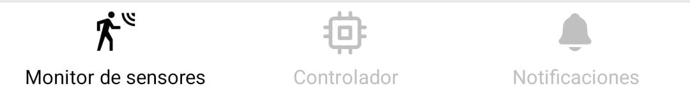
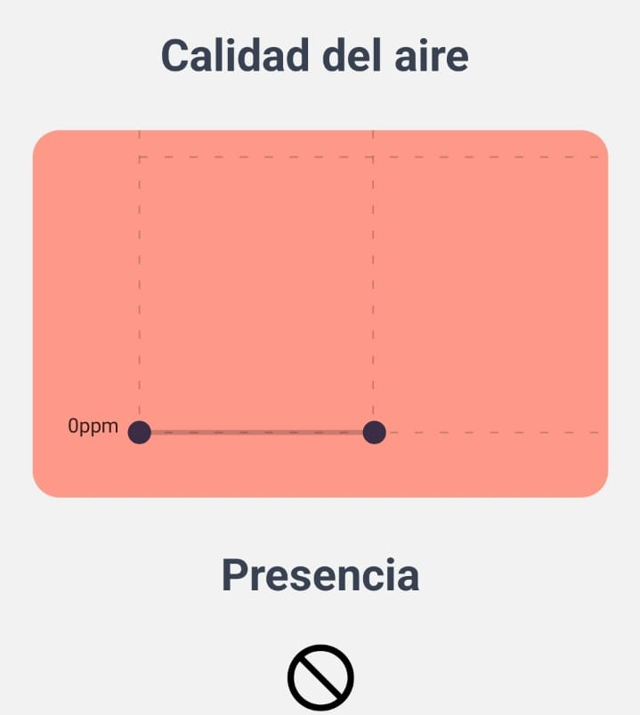
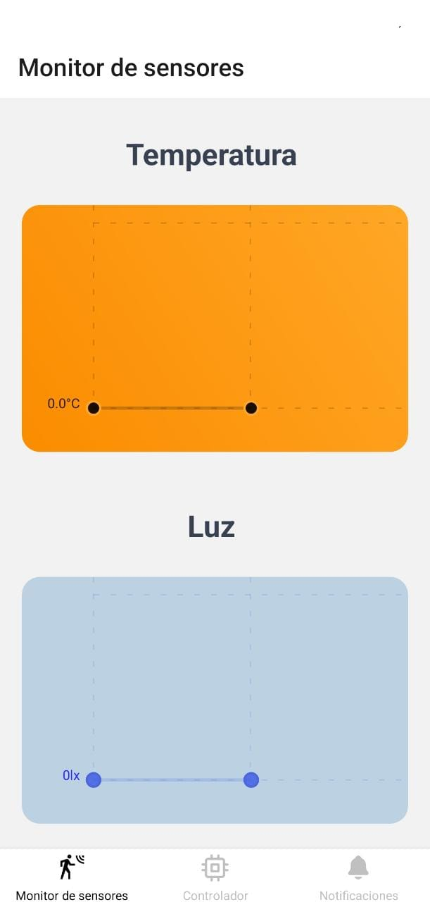
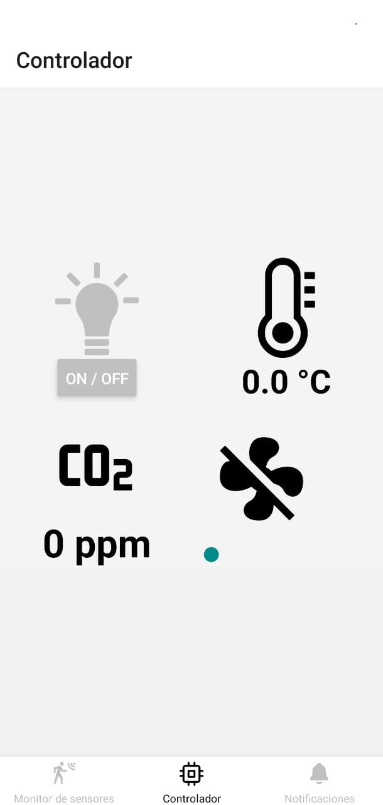
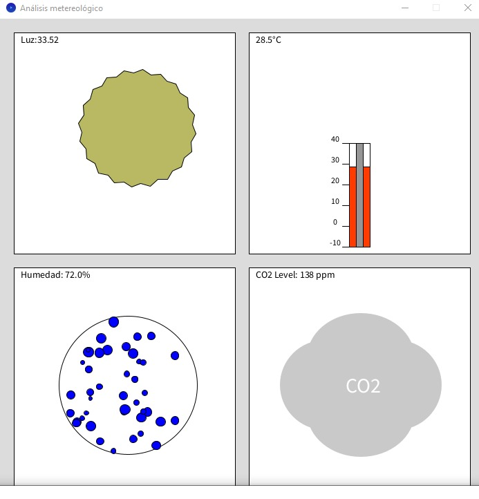
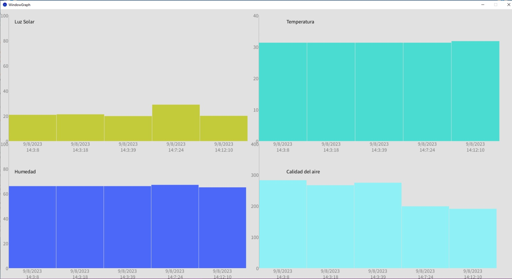

## MOCK-UP DE LA APLICACION MOVIL

La aplicacion movil cuenta con 3 pantallas, las cuales son parte esencial del dispositivo IoT y se puede acceder a ella por medio de una barra de navegacion que se encuentra en la parte inferior de la pantalla, de este modo, es importante profundizar en las diversas pantallas que ofrece en conjunto con sus funcionalidades, caracteristicas y diseño.

Barra de navegacion ubicado en parte inferior de aplicacion movil

## Monitor de sensores
La primera pantalla de la aplicacion movil denominada monitor de sensores consta de tres graficos los cuales dan una representacion histórica de los valores que se obtienen de los sensores y se actualizan en tiempo real, por lo que la primera grafica de color naranja es el que muestra el comportamiento de los valores de la temperatura, de esta forma, en el eje Y se representa su valor en °C. Por consiguiente, la siguiente grafica de color azul es similar a la grafica anterior en cuanto a funcionalidad, sin embargo, la representacion de los valores es diferente, ya que evidencia la informacion del sensosr de luz y la representacion de estos valores se hacen tambien por medio del eje vertical en lx, el cual se usa para la cantidad de luz proyectada.

Grafico de valores de temperatura y luz

Al ubicarse en la segunda parte de la pantalla de monitor de sensores se observara una tercera grafica, la cual en este caso es de color rojo y muestra la calidad de aire en base a ppm, es decir, se recibe los valores por medio del sensor y se muestran en el grafico de manera que al ser un valor alto la grafica tendra mayor altura a diferencia de obtener un dato pequeño que ocurre lo contrario. Finalmente, en esta primera pantalla se ve un simbolo de negacion, es decir, un circulo con una linea cruzada que indica que no se detecta presencia, por lo que al momento de detectar algo esta imagen se actualizara y cambiara para poder indicar que el sensor detecta una presencia en su alrededor.

  

Grafica de calidad de aire y representacion grafica de presencia

## Controlador
La pantalla de controlador tiene 4 opciones, por lo que cada uno tiene una funcionalidad distinta. La primera de ellas se hace al presionar la imagen del foco, el cual enciende la luz y lo demuestra cambiando de color la imagen a un tono mas claro, dicho de otro modo, al presionar el foco se mostrara de color amarillo en señal de que esta encendido. La segunda es un termometro que muestra cual es la temperatura actual en el texto que tiene debajo en °C. La tercera opcion es la que representa la calidad del aire haciendo uso de la unidad de medida ppm. Finalmente, la ultima imagen corresponde a la de un ventilador que al ser presionado se activa el sistema de ventilacion y aparecera en la parte inferior del ventilador el numero del nivel de ventilacion que esta activo, por lo que, su representacion es en tiempo real.

  

Controlador del dispositivo IoT

## Notificaciones

La tercera pantalla, por la tanto la ultima es un centro de notificaciones, en donde al momento de acceder en el se muestra un listado de las diversas notificaciones recibidas, las cuales cada una de ellas muestran diferentes mensajes como lo son advertencias sobre la mala calidad del aire o el tiempo que la luz queda encendida sin alguna presencia humanda, de esta manera, al final de cada mensaje muestra los valores de la temperatura en C°, la calidad del aire en ppm, el valor de luz en lux y si existe presencia o no. En la parte inferior de cada mensaje del sector de notificaciones contiene la fecha en formato mm/dd/aa y hora de recibido en hh:mm:ss.

Seccion de notificaciones con diversos mensajes
___

## MOCK-UP DE LA APLICACION WEB

La aplicación web cuenta con una interfaz en donde se pueden visualizar los gráficos y cambios que se generan en la temperatura, la humedad, la luz y el CO2 que se encuentran presentes en el lugar en el que se utiliza el dispositivo.

La estación meteorológica detecta las variaciones en el clima por medio de los sensores que tiene incorporados y con ayuda de la aplicación web, se visualiza en tiempo real tanto el valor aproximado de la temperatura, la intensidad de la luz, humedad y el CO2 así como también ilustraciones que varían según los cambios a los que se someten estos, con el objetivo de que el usuario pueda observar explícitamente dichas variaciones.  

Ilustración de los cambios en la Luz, Temperatura, Humedad y Calidad de Aire en la pagina web. 

Cada variación que el dispositivo detecta en diferentes periodos de tiempo, se van administrando en la base de datos para que posteriormente se puedan analizar los cambios meteorológicos por medio de graficas que se presentan en la pagina web.  

Graficas de Luz, Temperatura, Humedad y Calidad de Aire en la pagina web. 