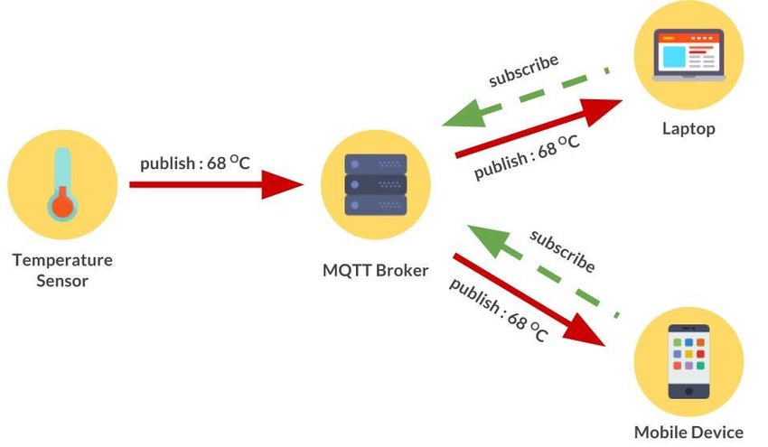
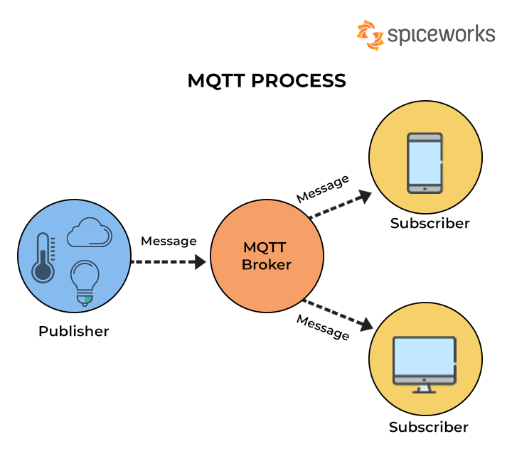
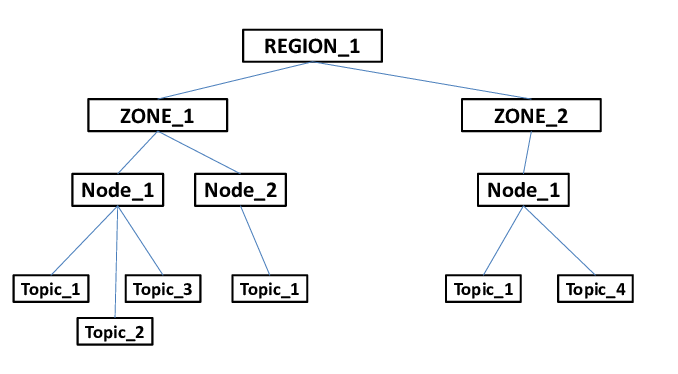

El termino MQTT tiene origen en sus siglas Message Queing Telemetry Transport, el cual es un protocolo de mensajería basado en ciertas reglas que se utiliza regularmente para establecer comunicación de un equipo a otro y que se ha establecido como una de las partes fundamentales de IoT en los últimos años a causa de su accesibilidad, agilidad y popularidad. Existen diversos dispositivos de IoT como sensores o dispositivos portátiles que por lo general tienen la tarea de transmitir informacion y recibir datos por medio de una red que contiene ciertas limitaciones como lo son las limitaciones de potencia, consumo y ancho de banda. Por lo que, estos dispositivos hacen uso de MQTT para poder transmitir datos, puesto que es mas simple de implementar y comunica los datos IoT de manera efectiva. MQTT está basado en la pila TCP/IP como base para su comunicación, esta herramienta fue creado por el Dr.Andy Stanford-Clark de IBM y Arlen Nipper de Arcom en el año de 1999 con la idea inicial de un mecanismo para conectar dispositivos empleados en la industria petrolera, puesto que los ingenieros necesitaban un protocolo para un ancho de banda mínimo y una pérdida de batería mínima para supervisas los oleoductos vía satélite.

Protocolo MQTT en IoT

Las ventajas que ofrece MQTT son amplias, una de ellas es que es escalable, puesto que su implementación necesita una cantidad mínima de código que consume poca energía en las operaciones haciendo que sea posible utilizar este protocolo para conectarse con millones de estos dispositivos. Además, facilita a los diferentes desarrolladores el cifrado de mensajes y la autenticación de dispositivos y usuarios brindando un sistema de seguridad fiable. Existen varios lenguajes con soporte para la implementación del protocolo MQTT de manera efectiva, como Python, JavaScript, Java, Go, C++, entre otros.

Otro componente importante en este protocolo es la estructura de los mensajes, ya que es uno de los pilares de la rapidez del protocolo. 

* Fixed Header: es un elemento obligatorio que ocupa de 2 a 5 bytes, por lo que consta de un codigo de control que localiza el tipo de mensaje enviado y de la longitud que tiene. La longitud ocupa una codificacion de 1 a 4 bytes.
* Optional Header: contiene la información extra que se requiere en ciertos mensajes dependiendo de su contexto, por lo que no es obligatorio.
* Payload: contiene el mensaje y puede tener un máximo de 256 mb

| Mensaje | Codigo de control |
|--------------|--------------|
| CONNECT       | 0x10              |
| CONNACK       | 0x20              |
| PUBLISH       | 0x30              |
| PUBACK        | 0x40              |
| PUBREC        | 0x50              |
| PUBREL        | 0x60              |
| PUBCOMP       | 0x70              |
| SUBSCRIBE     | 0x80              |
| SUBACK        | 0x90              |
| UNSUBSCRIBE   | 0xA0              |
| UNSUBACK      | 0xB0              |
| PINGREQ       | 0xC0=            |
| PINGRESP      | 0xD0              |
| DISCONNECT    | 0xE0              |

MQTT contiene un mecanismo de calidad del servicio o conocido tambien por sus siglas **QoS**, la cual se entiende como la forma de gestionar la robustez del envió de los mensajes al cliente ante posibles fallos. Por consiguiente, QoS corresponde a tres niveles.

* QoS 0 unacknowledged: el mensaje se envia unicamente una vez, por lo que el suscriptor puede no recibir alguno si se da un error.
* QoS 1 acknowledged: se envia el mensaje hasta que se confirme la entrega, es decir, en caso de un error el suscriptor puede recibir mensajes duplicados
* QoS 2 assured:  garantiza que cada uno de los mensajes se entrega al suscriptor una vez
    

El funcionamiento de MQTT conlleva diversos componentes, ya que es un servicio de mensajería push con un patron de publicador/suscriptor, por lo que los clientes se conectan con un servidor central denominado broker, el cual se explica a detalle a continuación.

## Broker
Broker es una clave en el protocolo MQTT, ya que es el principal encargado de recibir los mensajes enviados o transferidos por clientes y distribuirlos entre si en el sistema publicador/suscriptor, dicho de otro modo, es el delegado de almacenar, recibir y establecer el camino que deben tomar los mensajes MQTT desde los dispositivos clientes que publican mensajes hacia los dispositivos clientes que se encuentran interesados en los mensajes por medio de suscripciones. En otras palabras, broker es el sistema back-end y organiza los mensajes entre los diversos clientes. Además, dentro de sus responsabilidades engloba la autorización y autenticación de clientes MQTT, el control de mensajes perdidos y sesiones de clientes y por último enviar mensajes a otros sistemas para su posterior análisis detallado. 

### Tipos de Broker
El broker MQTT proporciona una diversa cantidad de tipos, los cuales cada uno tiene sus respectivas caracteristicas y se dividen en gratuitas y de paga como se muestra a continuación.

* Gratuitos
    * Broker MQTT 3.1.1 (Moquette): Moquette es un tipo de broker ligero y eficiente a nivel de recursos que gestiona los mensajes MQTT entre los diferentes dispositivos cliente y un dispositivo principal de Greengrass. Además, dentro de sus características se encuentra que admite los tres niveles de calidad de servicio definidos para MQTT. Sus principales usos son para dispositivos IoT y para backend de mensajería en aplicaciones que funcionan en tiempo real

    * Broker MQTT 5 (EMAX): Componente que proporciona una version modificada del Broker EMQX y ofrece un control de sesión optimizado. Por lo que, se implementa para usar las funciones de MQTT 5 en la comunicación entre los dispositivos que tienen el rol de cliente y dispositivo principal. Por añadidura, una característica de este tipo de broker es que los clientes tienen la disponibilidad de solicitar que el broker retenga mensajes durante su desconexión y los brinde una vez que el cliente se reconecte, por consiguiente, la perdida de datos es poco probable.

    * EMQTT: denominado Erlan MQTT broker es de tipo Open Source, desarrollado en Erlang/OTP, por lo que está diseñado para aplicaciones con grandes exigencias en escalabilidad, es decir, para grandes empresas que exigen altas cantidades de respuestas a una velocidad alta.

    * ActiveMQ: es uno de los broker de mensajería con alta popularidad que se encuentra desarrollado por Apache, por lo que admite el protocolo MQTT. Proporciona una implementación de alto rendimiento y es de codigo abierto, por lo que es gratuito y accesible para los interesados en esta tecnología.

    * HBMQTT: Es uno de los broket MQTT Open Source más famosos, el cual esta escrito en Python que funciona principalmente sobre asyncio.
 
    * Mosquitto: considerado como el broker con mayor popularidad entre todos, el cual es fundado por la Fundación Eclipse y se distribuye bajo las licencias EPL y EDL. El broker Mosquitto esta implementado principalmente en el lenguaje C, por consiguiente, es altamente eficiente y adecuado para desenvolverse en diferentes plataformas. Entre sus principales características esta su ligereza, lo que lo vuelve un candidato principal para aplicaciones IoT, también cuenta con la ventaja de ser escalable y utilizable en aplicaciones de gran escala o industriales donde la comunicación MQTT es prioridad para la gestión de dispositivos conectados
* De paga
    * AWS IoT Core: Uno de los brokers de paga es el que brinda AWS IoT Core, el cual tiene una escalabilidad amplia y tiene la capacidad de manejar altas cantidades de conexiones. Además, al ser proporcionado por aws la integración con otros servicios son mas fáciles de acoplar y contiene un soporte multiplataforma con diversos dispositivos y plataformas, por lo que su administración en dispositivos del internet de las cosas es mas sencillo.
    * EMQX: un broker que contiene una version gratuita de codigo abierto, sin embargo, tiene una version empresarial de paga que contiene una de los brokers con mayor escalabilidad, por lo que mueve y procesa millones de mensajes por segundo por medio del protocolo MQTT. La arquitectura del broker puede ser de tipo centralizo o distribuido, por consiguiente, al ser centralizado un unico broker gestiona la comunicación con los clientes, por otro lado, al ser distribuido son varios agentes los que trabajan en conjunto para proporcionar una infraestructura de mensajeria escalable y a prueba de varios errores o fallos.
    * Google Cloud IoT Core: La version pagada que ofrece Google sobre Cloud IoT para empresas con alta demanda proporciona un broker MQTT altamente seguro y confiable para facilitar la comunicación, proporcionando una comunicación en ambas direcciones, es decir de los dispositivos a los servidores en la nube y viceversa.
    
## Publisher
Otro destino fundamental de MQTT es el llamado publisher que se encarga de publicar mensajes a un tema en el broker del protocolo y los datos los hace en formato de bytes. Los subscribers y los brokers comienzan a comunicarse por medio del publisher. En su mayoría los clientes inician la conexión al brindar un mensaje **CONECTAR** al broker. Posteriormente, el broker confirma la conexión establecida al responder con un mensaje **CONNACK**. Los subscribers en ningun momento se conectan entre si, puesto que únicamente lo hacen con el agente o broker. En conclusión, los publicadores de MQTT son componentes que tienen alta importancia para el envio de datos y mensajes en tiempo real apoyandose del protocolo MQTT, de este modo, es popular en el ambito de las aplicaciones que necesitan comunicación en tiempo real debido a su optima capacidad de satisfacer esta necesidad

## Subscriber
El tercer pilar del proceso de MQTT es el de subscriber el cual hace referencia a cualquier dispositivo, es decir, desde un servidor hasta un microcontrolador que ejecuta una biblioteca MQTT. Por lo que, si el cliente envía mensajes actúa como un editor, y si recibe actúa como un receptor, de esta forma, cualquier dispositivo que se comunique por medio del protocolo MQTT se considera como subscriber. El subscriber en diversas ocasiones se suscribe a un tema puntual para poder recibir lo que le brinda el publisher y pasa por medio del broker. El subscriber dentro de sus características contiene que puede desconectarse del broker y luego volver a conectare, por lo que al reconectarse de manera apropiada automáticamente el broker comienza a reenviar los mensajes publicados en los temas a los que se encuentra suscrito el subscriber. Finalmente, el subscriber del protocolo MQTT es utilizable en diversos aspectos pero principalmente en el monitoreo de sensores en dispositivos IoT.

Diagrama de funcionamiento de subscriber, broker y publisher
## Topic
El topic o también conocido por tema en el idioma español es un elemento fundamental que realiza un filtro de mensajes aplicado por los Brokers de MQTT para ejecutar una decisión sobre que clientes suscritos es enviado y a quienes no, de este modo, estos mensajes son recibidos desde los publicadores o publishers. Los temas se encuentran principalmente ordenados para evitar diversos problemas como confusiones, por consiguiente, se encuentran formados por uno o mas niveles separados entre si por una barra inclinada o diagonal, siendo esto similar a un directorio de archivo o carpeta. 

El funcionamiento de estos topics son poco complejos, ya que el broker aceptar todos los topics, luego los clientes se pueden suscribir a uno o varios temas, de este modo, el cliente tiene la capacidad de establecer varias suscripciones. Por ultimo, el cliente publica mensajes indicando un único Topic logrando que el broker reciba el mensaje y se inicie la búsqueda de alguna suscripción que cumpla con el filtro empleado por el Topic, así se transmite el mensaje a los clientes que se encuentran suscritos.

Algunos consejos para la implementación de Topics es diseñar sus sistema de una manera que sea ampliable y sustentable, puesto que es importante tener consideración en la escalabilidad para lograr evitar tener un sistema que sea insuficiente y no pueda satisfacer las necesidades del sistema IoT. Además, es recomendable tener los Topics lo mas pequeños y entendibles posible, de esta forma, los topics deben ser lo mas específicos posibles para una mejor gestión y evitar el envio de mensajes a varios dispositivos hacer la discriminación por el contenido del mensaje.

Arbol del flujo de topics
