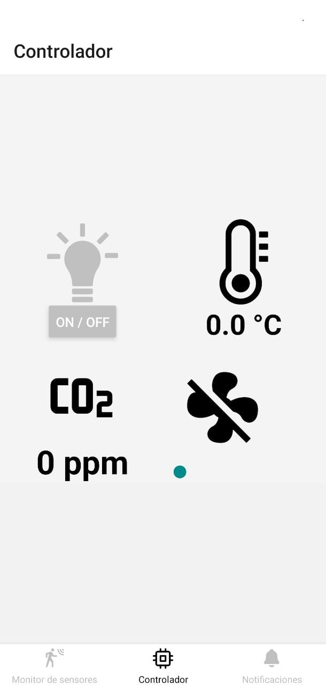
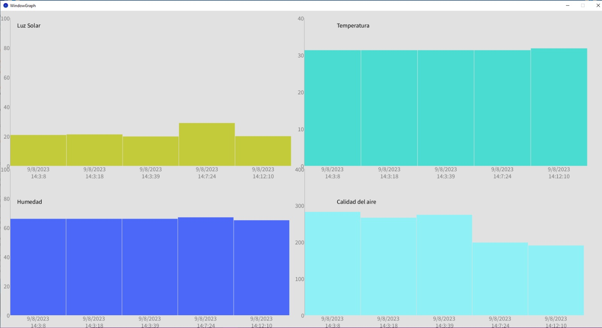
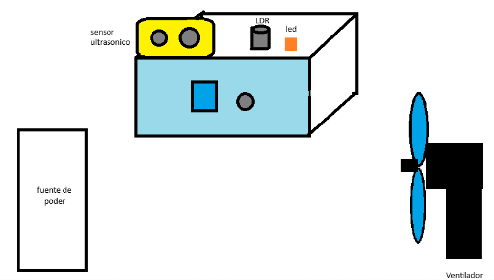

# 
 PRÁCTICA NO. 2 

# DESCRIPCIÓN 
Una estación meteorológica de Internet de las cosas (IoT) representa un sistema avanzado de seguimiento que incorpora una variedad de sensores para adquirir información en tiempo real acerca de las condiciones climáticas. Es por eso que se creado un dispositivo diseñado específicamente para recolectar datos sobre las cuatro variables principales, que son la temperatura, la luminosidad y la concentración de dióxido de carbono (CO2) en el aire. Este dispositivo reúne la información proveniente de los sensores y la transmite a una plataforma en donde los datos se registran a través una base de datos y pueden ser visualizados por medio de una aplicación web y una aplicación móvil. Esto brinda la posibilidad a los usuarios de supervisar y tomar medidas con relación a los diversos elementos que son gestionados por la estación.

## Funcionamiento : 

La estación meteorológica cumple con distintas funciones principales como la medición de la temperatura, identificar la calidad de luz en el ambiente, la medición de la calidad del aire, la medición de proximidad, la conexión inalámbrica y la activación de actuadores. 

El dispositivo tiene la capacidad de evaluar la temperatura del entorno en el que se encuentra y ofrecer información precisa sobre los cambios de temperatura que están ocurriendo en ese momento, así como también incorpora sensores que detectan la calidad de la luz ambiental, miden la cantidad de CO2 del ambiente para determinar la calidad del aire, reconoce la proximidad de un objeto o persona con la finalidad de comprobar la ausencia o presencia de dicho objetivo en el lugar. 

Este dispositivo cuenta con un sistema que permite una conexión completamente inalámbrica por medio de un componente wifi el cual funciona como interfaz entre el Arduino y la base de datos. Este sistema también proporciona la opción de involucrase con cualquiera de los diferentes actuadores que se encuentren disponibles.  

## Usos :

Esta estación meteorológica recopila información de los sensores incorporados y los transmite a través de Internet hacia una plataforma centralizada utilizando técnicas como las colas de mensajes. Estos datos se almacenan y son accesibles mediante una aplicación web y una aplicación móvil, lo que permite a los usuarios supervisar en tiempo real las condiciones climáticas en un entorno específico o realizar un seguimiento de las tendencias a lo largo del tiempo.

La aplicación móvil funciona a través de una interfaz gráfica amigable que contiene información sobre el sistema de seguridad y el sistema de ventilación, con el objetivo de que el usuario pueda visualizar cada uno de los datos que se recopilación de los cambios que los sensores del dispositivo lograron detectar en la temperatura, en la calidad de aire y si lograron realizar la medición de proximidad. La aplicación web también cuenta con una interfaz grafica en la que se pueden visualizar las gráficas de la temperatura de la habitación, de la presencia humana, de la iluminación y de la calidad del aire. 

## Beneficios :

El sistema es administra un entorno inteligente dentro de una habitación o en un lugar en específico, garantizando que las condiciones sean saludables para la persona que lo ocupa asi como también otros beneficios como: 

- El sistema proporciona mediciones precisas de las condiciones climáticas en tiempo real, lo que es esencial para la toma de decisiones informadas.

- Permite la detección de cambios significativos en la temperatura, la luz o la concentración de CO2, lo que puede ayudar a prevenir problemas o tomar medidas preventivas.

- Ayuda a optimizar el uso de energía al analizar la iluminación y la temperatura, lo que puede conducir a un ahorro significativo de costos energéticos.

- Contribuye a crear un entorno saludable y cómodo para los ocupantes al controlar la temperatura y la calidad del aire, lo que puede mejorar la productividad y el bienestar.

- Permite a los usuarios supervisar y controlar el entorno desde cualquier lugar a través de aplicaciones web y móviles, lo que brinda comodidad y flexibilidad.

- Los datos recopilados pueden ser valiosos para la investigación científica y la comprensión de los patrones climáticos locales.

## Impacto Ambiental : 

Una estación meteorológica de IoT que monitorea e integra diversos sensores para recopilar datos climáticos en tiempo real en realidad tiene un impacto ambiental positivo. Estas estaciones a menudo están diseñadas para ser altamente eficientes en términos de consumo de energía. Esto significa que requieren una cantidad mínima de energía para funcionar, lo que reduce su huella de carbono. Como permiten un monitoreo más preciso del clima y la calidad del aire, estas estaciones pueden ayudar a optimizar el uso de recursos como la calefacción, la refrigeración y la iluminación en edificios y espacios, lo que también conduce a un menor consumo de energía. 

Al recopilar datos sobre la concentración de CO2 en el aire, este dispositivo contribuye a la conciencia sobre la calidad del aire y la importancia de reducir las emisiones de gases de efecto invernadero, lo que promueve prácticas más sostenibles. Estos datos también son valiosos para la investigación científica y pueden contribuir al entendimiento y la mitigación del cambio climático y otros fenómenos ambientales ya que, al monitorear las condiciones climáticas en tiempo real, se puede predecir y preparar para eventos climáticos extremos, lo que puede reducir el impacto de desastres naturales en el medio ambiente.

___

## MOCK-UP DE LA APLICACION MOVIL

La aplicacion movil cuenta con 3 pantallas, las cuales son parte esencial del dispositivo IoT y se puede acceder a ella por medio de una barra de navegacion que se encuentra en la parte inferior de la pantalla, de este modo, es importante profundizar en las diversas pantallas que ofrece en conjunto con sus funcionalidades, caracteristicas y diseño.

Barra de navegacion ubicado en parte inferior de aplicacion movil

## Monitor de sensores
La primera pantalla de la aplicacion movil denominada monitor de sensores consta de tres graficos los cuales dan una representacion histórica de los valores que se obtienen de los sensores y se actualizan en tiempo real, por lo que la primera grafica de color naranja es el que muestra el comportamiento de los valores de la temperatura, de esta forma, en el eje Y se representa su valor en °C. Por consiguiente, la siguiente grafica de color azul es similar a la grafica anterior en cuanto a funcionalidad, sin embargo, la representacion de los valores es diferente, ya que evidencia la informacion del sensosr de luz y la representacion de estos valores se hacen tambien por medio del eje vertical en lx, el cual se usa para la cantidad de luz proyectada.

Grafico de valores de temperatura y luz

Al ubicarse en la segunda parte de la pantalla de monitor de sensores se observara una tercera grafica, la cual en este caso es de color rojo y muestra la calidad de aire en base a ppm, es decir, se recibe los valores por medio del sensor y se muestran en el grafico de manera que al ser un valor alto la grafica tendra mayor altura a diferencia de obtener un dato pequeño que ocurre lo contrario. Finalmente, en esta primera pantalla se ve un simbolo de negacion, es decir, un circulo con una linea cruzada que indica que no se detecta presencia, por lo que al momento de detectar algo esta imagen se actualizara y cambiara para poder indicar que el sensor detecta una presencia en su alrededor.

  

Grafica de calidad de aire y representacion grafica de presencia

## Controlador
La pantalla de controlador tiene 4 opciones, por lo que cada uno tiene una funcionalidad distinta. La primera de ellas se hace al presionar la imagen del foco, el cual enciende la luz y lo demuestra cambiando de color la imagen a un tono mas claro, dicho de otro modo, al presionar el foco se mostrara de color amarillo en señal de que esta encendido. La segunda es un termometro que muestra cual es la temperatura actual en el texto que tiene debajo en °C. La tercera opcion es la que representa la calidad del aire haciendo uso de la unidad de medida ppm. Finalmente, la ultima imagen corresponde a la de un ventilador que al ser presionado se activa el sistema de ventilacion y aparecera en la parte inferior del ventilador el numero del nivel de ventilacion que esta activo, por lo que, su representacion es en tiempo real.

  

Controlador del dispositivo IoT

## Notificaciones

La tercera pantalla, por la tanto la ultima es un centro de notificaciones, en donde al momento de acceder en el se muestra un listado de las diversas notificaciones recibidas, las cuales cada una de ellas muestran diferentes mensajes como lo son advertencias sobre la mala calidad del aire o el tiempo que la luz queda encendida sin alguna presencia humanda, de esta manera, al final de cada mensaje muestra los valores de la temperatura en C°, la calidad del aire en ppm, el valor de luz en lux y si existe presencia o no. En la parte inferior de cada mensaje del sector de notificaciones contiene la fecha en formato mm/dd/aa y hora de recibido en hh:mm:ss.

Seccion de notificaciones con diversos mensajes
___

## MOCK-UP DE LA APLICACION WEB

La aplicación web cuenta con una interfaz en donde se pueden visualizar los gráficos y cambios que se generan en la temperatura, la humedad, la luz y el CO2 que se encuentran presentes en el lugar en el que se utiliza el dispositivo.

La estación meteorológica detecta las variaciones en el clima por medio de los sensores que tiene incorporados y con ayuda de la aplicación web, se visualiza en tiempo real tanto el valor aproximado de la temperatura, la intensidad de la luz, humedad y el CO2 así como también ilustraciones que varían según los cambios a los que se someten estos, con el objetivo de que el usuario pueda observar explícitamente dichas variaciones.  

Ilustración de los cambios en la Luz, Temperatura, Humedad y Calidad de Aire en la pagina web. 

Cada variación que el dispositivo detecta en diferentes periodos de tiempo, se van administrando en la base de datos para que posteriormente se puedan analizar los cambios meteorológicos por medio de graficas que se presentan en la pagina web.  

Graficas de Luz, Temperatura, Humedad y Calidad de Aire en la pagina web. 

___

## BOCETOS DEL PROTOTIPO

Boceto del Prototipo por fuera. 

Boceto del Prototipo por dentro. 
___

## PROTOTIPO PROPUESTO

Imagen del prototipo por fuera. 

Imagen del prototipo por dentro. 

Imagen de la fuente de poder del computador para alimentacion externa. 

___

~~~
Universidad San Carlos de Guatemala 2023

Daniel Estuardo Cuque Ruíz - 202112145
Alvaro Norberto García Meza - 202109567
Damián Ignacio Peña Afre - 202110568
Aída Alejandra Mansilla Orantes - 202100239 
Lesther Kevin Federico López Miculax - 202110897
~~~