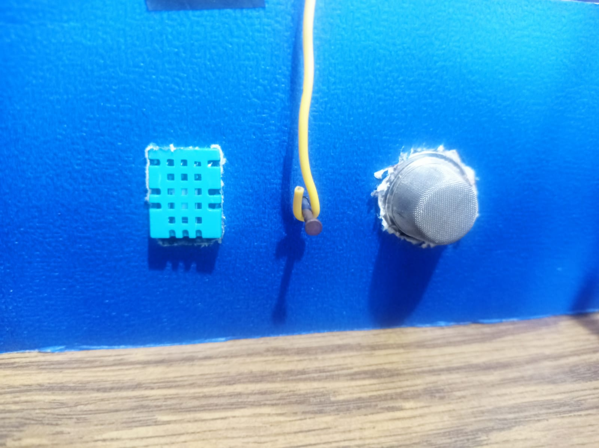
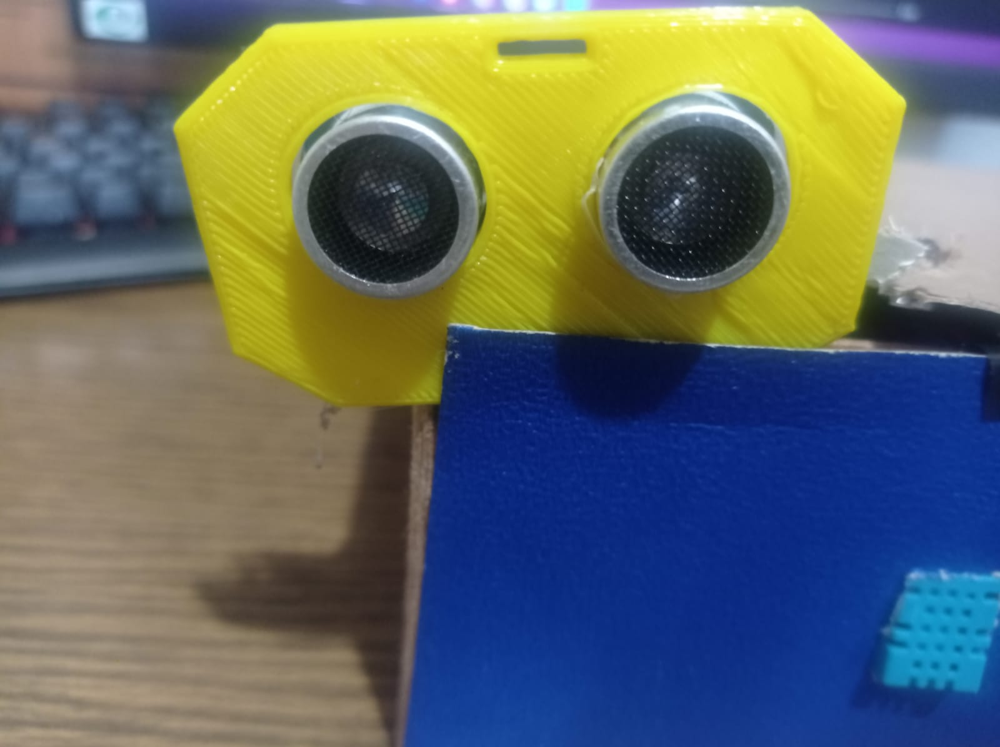
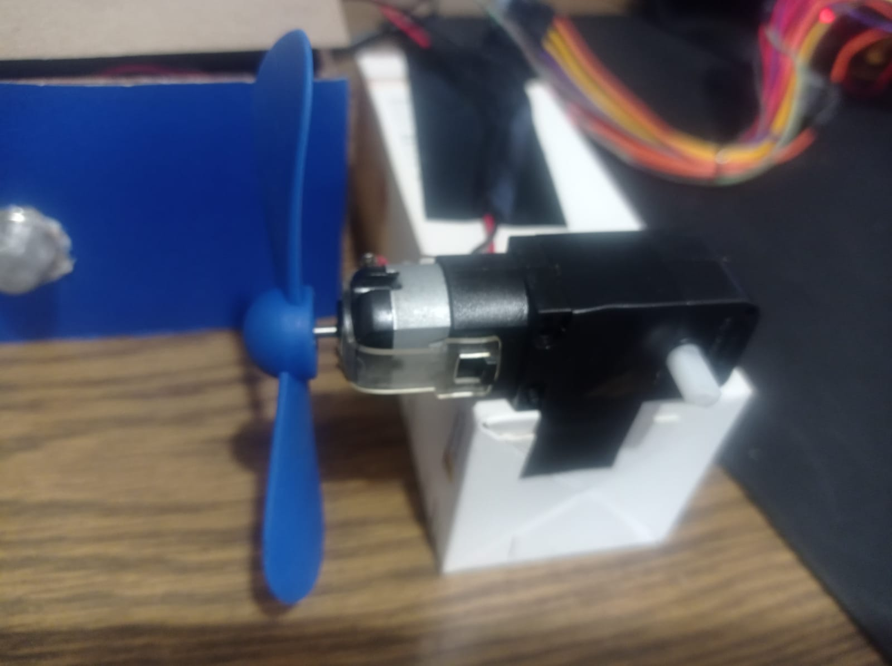
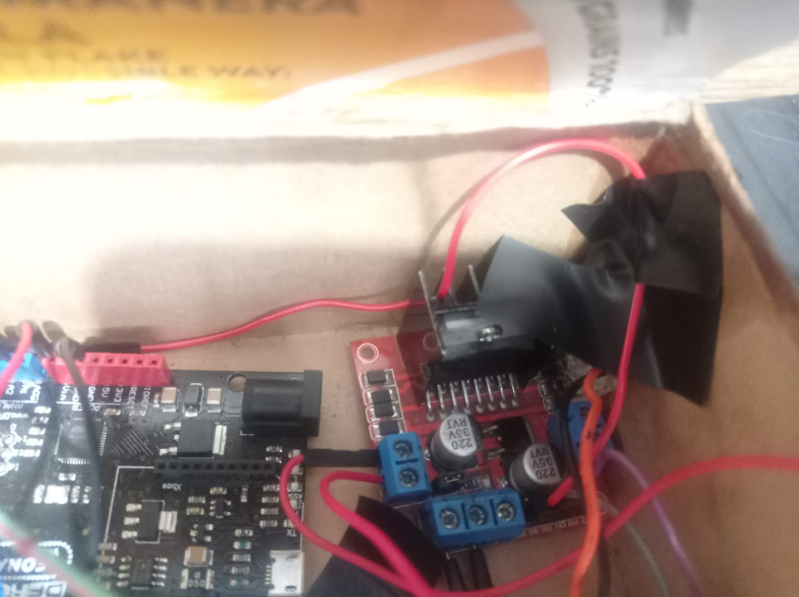
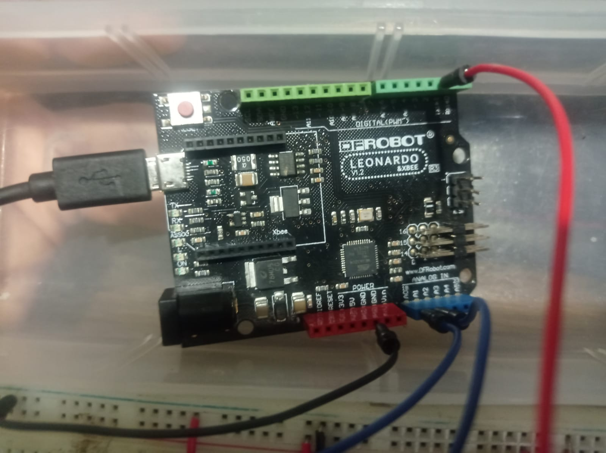
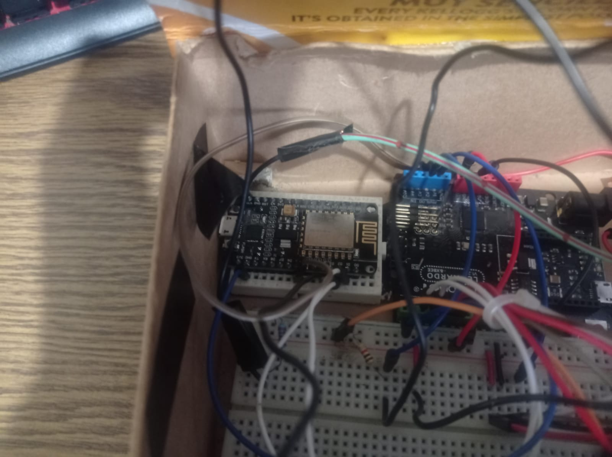
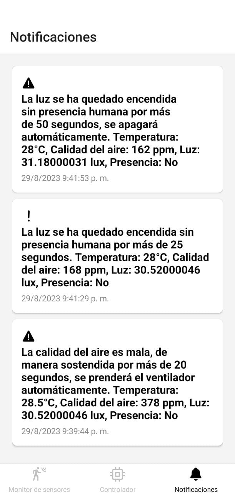

### Device Hardware
La primera capa corresponde a Device Hardware, la cual hace referencia a los diferentes componentes físicos que componen el dispositivo de control climático en alcobas, de esta forma, engloba principalmente los sensores, un puente H, el Arduino, el ventilador, el módulo wifi de comunicación utilizado y el servomotor. Los sensores del dispositivo IoT son una parte fundamental de esta capa, puesto que son los principales receptores de la información a procesar, por lo que se usó un sensor de tipo MQ-135 para medir la calidad del aire, un LDR para capturar la referencia de la cantidad de luz en el ambiente, un sensor ultrasónico HC SR04 que detecta la presencia, también contiene en su estructura un sensor de tipo DHT-11, el cual es un módulo que brinda la información adecuada para obtener la temperatura en el ambiente. Por otro lado, el Arduino también forma parte de esta capa, el cual es el encargado de procesar la información que recopila los sensores y los manipula por medio de código que se explica en la segunda capa, además se ocupa de la conectividad con el módulo wifi, el cual es de tipo Node MCU ESP8266 que es un componente electrónico que integra todas las funcionalidades requeridas para ejecutar la conectividad de manera inalámbrica. Por último, otros componentes fundamentales son el ventilador que funciona en conjunto con un puente H lm298n que por medio de modulación del ancho de pulso (PWM) controla sus velocidades y el servomotor que ocupa el rol de dispositivo actuador, por lo tanto el ventilador y el servomotor se accionan dependiendo del estado en el que se encuentra el sistema o indica que el usuario.

DHT11 (izq) y MQ135 (derecha)

Sensor ultrasonico HC SR04

Ventilador correspondiente al sistema de ventilacion

Puente H LM298N

Arduino correspondiente a la capa de Device Hardware

### Device Software
Device Software hace referencia a la segunda capa del Framework IOT y consta del código que se ejecuta específicamente en el procesador del dispositivo y controla su funcionalidad, por lo que el hardware o lo que conlleva la primera capa se convierte en un dispositivo inteligente. Por consiguiente, la segunda capa se hace presente en el programa cargado en el Arduino, logrando que este código basado en el módulo WiFi se ejecute de forma correcta línea por línea y se controle diversos aspectos como lo son el cliente de WebSockets, el funcionamiento del ventilador, la comunicación serial, la administración de la luz y el manejo de los sensores que captan la información.

### Communication
La capa de comunicación, es decir, la tercera capa del dispositivo IoT esta representado por todas las diferentes formas en la que el dispositivo intercambia información. Por lo que, existen diversas tecnologías para las comunicaciones IoT, siendo las más comunes Wi-Fi, Bluetooth y red cableada. Por lo tanto, en el contexto del dispositivo IoT presentado el intercambio de información se da por medio de la comunicación Wi-Fi, el cual funciona por medio del modulo Wi-Fi Node MCU ESP8266 mencionado anteriormente en la primera capa. Esta forma de comunicación funciona de manera que es capaz de enviar y recibir información de manera efectiva teniendo control por medio de otro protocolo denominado MQTT, el cual tiene ciertas reglas específicas sobre como deben transmitirse y formatear los datos que pasan por el proceso de comunicación, de esta forma, estas reglas se profundizan adecuadamente en otro punto de la documentación.

Tarjeta de desarrollo Node MCU ESP8266

### Cloud Platform
En esta cuarta capa del dispositivo IoT el proceso que ocurre es el del almacenamiento de los datos compartidos por parte de la estación meteorológica. En otras palabras, el dispositivo inteligente transmite información que posteriormente se guarda en la nube para su posterior uso, en este caso para el almacenamiento, procesamiento y análisis de los datos con diversos propósitos como la realización de los gráficos o notificaciones. De este modo, este tipo de capa se conforma por una API del dispositivo que tiene su desarrollo en base al framework Nest.Js, la cual funciona como un punto comun donde se manejan los errores y se distribuye la información, además proporciona herramientas que hacen mas simplificado el proceso de desarrollo para su posterior almacenamiento en otra tecnología denominada Redis que también conforma esta capa, esta tecnología es una plataforma de almacenamiento de datos que proporciona respuestas inferiores al milisegundo y se utiliza con datos en pares de clave-valor, por lo que se convierta en una herramienta potente, sólida y útil  en el campo de los dispositivos IoT, por consiguiente, es el principal exponente de la capa Cloud Platform del dispositivo creado.

### Cloud Applications
La capa final corresponde principalmente a las aplicaciones que tiene acceso el usuario final, es decir, las partes del sistema que el cliente podrá percibir y con las que podrán interactuar de manera seguida. Esta capa esta formada por una aplicación móvil que se realizó con el propósito de que sea interactiva para el usuario y tenga una efectividad adecuada. Por consiguiente, la aplicación móvil está formada por distintas tecnologías, siendo las principales React Native y el framework de desarrollo de aplicaciones móviles Expo, el cual proporciona de manera eficaz distintas facilidades para el desarrollo móvil. Por otro lado, React Native es un framework que proporciona la base para la aplicación móvil y brinda la posibilidad al desarrollo de sus componentes como lo son los diversos botones, textos e imágenes, además proporciona librerías como la denominada react-native-chart-kit que desenvuelve un papel importante en la generacion de los gráficos, de esta forma, react native se combina con CSS, el cual proporciona el estilo de los componentes de la aplicación móvil. Finalmente, una segunda parte crucial de la última capa es la aplicación web que también cuenta con una interfaz con su respectivo diseño y estilo que brinda interacción con el usuario final de diferentes formas como lo es la manipulación de la iluminación, entre otras características que conlleva el dispositivo. 

Aplicación movil correspondiente al sector de Cloud Applications