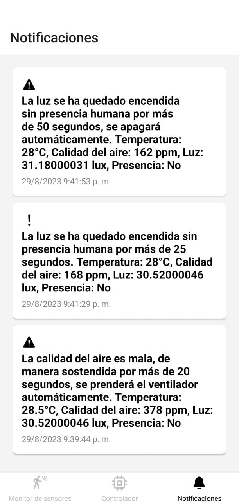

# PROYECTO 1

## Introducción 
Este proyecto altamente innovador conocido como Weather Sensor, forma parte de la pila tecnológica de Internet de las cosas (IoT). Demuestra la convergencia de múltiples capas de software y hardware para dar vida a un dispositivo meteorológico de vanguardia y completamente conectado. El propósito principal de este dispositivo es recopilar información ambiental de vital importancia, abarcando desde la medición de la intensidad lumínica y la calidad del aire hasta la humedad y la temperatura del entorno en el que se encuentra.

Este impresionante ejemplo de integración tecnológica demuestra cómo la IoT está revolucionando la forma en que interactuamos con el mundo que nos rodea. La implementacion de sensores avanzados, análisis de datos en tiempo real y conectividad inalámbrica permite no solo la recopilación de información precisa sobre las condiciones ambientales, sino también la capacidad de interpretar estos datos de manera significativa. Los análisis profundos permiten comprender las tendencias y los patrones climáticos, lo que a su vez puede respaldar la toma de decisiones informadas en una variedad de campos, desde la agricultura hasta la planificación urbana.
___

## Bocetos del Prototipo

Boceto del Prototipo por fuera. 

Boceto del Prototipo por dentro. 
___

## Construcción del Prototipo

Imagen del prototipo por fuera. 

Imagen del prototipo por dentro. 

Imagen de la fuente de poder del computador para alimentacion externa. 

___

~~~
Universidad San Carlos de Guatemala 2023

Daniel Estuardo Cuque Ruíz - 202112145
Alvaro Norberto García Meza - 202109567
Damián Ignacio Peña Afre - 202110568
Aída Alejandra Mansilla Orantes - 202100239 
Lesther Kevin Federico López Miculax - 202110897
~~~

## Pantallas de la aplicación móvil 
La aplicacion movil cuenta con 3 pantallas, las cuales son parte esencial del dispositivo IoT y se puede acceder a ella por medio de una barra de navegacion que se encuentra en la parte inferior de la pantalla, de este modo, es importante profundizar en las diversas pantallas que ofrece en conjunto con sus funcionalidades, caracteristicas y diseño.

Barra de navegacion ubicado en parte inferior de aplicacion movil

### Monitor de sensores
La primera pantalla de la aplicacion movil denominada monitor de sensores consta de tres graficos los cuales dan una representacion histórica de los valores que se obtienen de los sensores y se actualizan en tiempo real, por lo que la primera grafica de color naranja es el que muestra el comportamiento de los valores de la temperatura, de esta forma, en el eje Y se representa su valor en °C. Por consiguiente, la siguiente grafica de color azul es similar a la grafica anterior en cuanto a funcionalidad, sin embargo, la representacion de los valores es diferente, ya que evidencia la informacion del sensosr de luz y la representacion de estos valores se hacen tambien por medio del eje vertical en lx, el cual se usa para la cantidad de luz proyectada.

Grafico de valores de tempreatura y luz

Al ubicarse en la segunda parte de la pantalla de monitor de sensores se observara una tercera grafica, la cual en este caso es de color rojo y muestra la calidad de aire en base a ppm, es decir, se recibe los valores por medio del sensor y se muestran en el grafico de manera que al ser un valor alto la grafica tendra mayor altura a diferencia de obtener un dato pequeño que ocurre lo contrario. Finalmente, en esta primera pantalla se ve un simbolo de negacion, es decir, un circulo con una linea cruzada que indica que no se detecta presencia, por lo que al momento de detectar algo esta imagen se actualizara y cambiara para poder indicar que el sensor detecta una presencia en su alrededor.

  

Grafica de calidad de aire y representacion grafica de presencia

### Controlador
La pantalla de controlador tiene 4 opciones, por lo que cada uno tiene una funcionalidad distinta. La primera de ellas se hace al presionar la imagen del foco, el cual enciende la luz y lo demuestra cambiando de color la imagen a un tono mas claro, dicho de otro modo, al presionar el foco se mostrara de color amarillo en señal de que esta encendido. La segunda es un termometro que muestra cual es la temperatura actual en el texto que tiene debajo en °C. La tercera opcion es la que representa la calidad del aire haciendo uso de la unidad de medida ppm. Finalmente, la ultima imagen corresponde a la de un ventilador que al ser presionado se activa el sistema de ventilacion y aparecera en la parte inferior del ventilador el numero del nivel de ventilacion que esta activo, por lo que, su representacion es en tiempo real.

  

Controlador del dispositivo IoT

### Notificaciones

La tercera pantalla, por la tanto la ultima es un centro de notificaciones, en donde al momento de acceder en el se muestra un listado de las diversas notificaciones recibidas, las cuales cada una de ellas muestran diferentes mensajes como lo son advertencias sobre la mala calidad del aire o el tiempo que la luz queda encendida sin alguna presencia humanda, de esta manera, al final de cada mensaje muestra los valores de la temperatura en C°, la calidad del aire en ppm, el valor de luz en lux y si existe presencia o no. En la parte inferior de cada mensaje del sector de notificaciones contiene la fecha en formato mm/dd/aa y hora de recibido en hh:mm:ss.

Seccion de notificaciones con diversos mensajes

##  Capas del framework de IoT.
### Device Hardware
La capa inicial de Device Hardware hace referencia a los componentes fisicos que componen la estación meteorológica, la cual engloba principalmente los diversos sensores, el arduino, el ventilador, el protoboard y el modulo wi-fi utilizado. Los sensores del dispositivo IoT son una parte fundamental de esta capa, puesto que son los principales receptores de informacion, por lo que se uso un sensor de tipo MQ-135 para medir la calidad del aire, un sensor ultrasonico HC SR04 que detecta la presencia, ademas contiene en su estructura un sensor de tipo DHT-11, el cual es un modulo que brinda la informacion adecuada para obtener la de la temperatura en el ambiente. Por otro lado, el arduino tambien forma parte de esta capa, el cual es el encargado de procesar la información que recopila los sensores y los manipula por medio de codigo, tambien se ocupa de la conectividad con el modulo Wi-Fi. Finalmente, el módulo wi-fi previamente mencionado del dispositivo es de tipo Node MCU ESP8266, el cual es un componente electrónico que integra todas las funcionalidades requeridas para ejecutar la conectividad de manera inalambrica

Ventilador correspondiente al sistema de ventilacion

Dht11 (izq) y mq135 (derecha)

Sensor ultrasonico HC SR04

Puente H LM298N

### Device Software
Device Software hace referencia a la segunda capa del Framework IOT y consta del codigo que se ejecuta especificamente en el procesador del dispositivo, en este caso, la estacion meteorológica. Por consiguiente, la segunda capa se hace presente en el programa cargado en el Arduino, logrando que este codigo basado en el modulo WiFi se ejecute de manera efectiva linea por linea y se controle diversos aspectos como lo son el cliente de WebSockets, el funcionamiento del ventilador, la comunicacion serial, el gestionamiento de la luz y  el manejo de los sensores que captan la información.

### Communication
La capa de comunicacion, es decir, la tercera capa del dispositivo IoT esta representado por la forma en la que el dispositivo intercambia información, siendo en este caso el intercambio de información por medio de la comunicación Wi-Fi, el cual funciona por medio del modulo Wi-Fi mencionado en la primera capa. Este protocolo de comunicacion funciona de manera que es capaz de enviar y recibir información de manera efectiva teniendo control por medio de la API que tiene su desarrollo en base al framework Nest.Js, la cual es caracterizado por ser altamente efectivo para la creación de aplicaciones del lado del servidor, proporcionando herramientas que hacen mas simplificado el proceso de desarrollo para una comunicacion optima, por lo que tambien forma de esta capa y es la encargada de procesar las solicitudes que realiza el usuario y retorna una respuesta conforme a lo que el cliente consultó. Además, mantiene diversas funciones y protocolos basados en WebSocket, lo que permite una respuesta de comunicacion en tiempo real, es decir, generar notificaciones y transmision de datos en vivo.

Tarjeta de desarrollo Node MCU ESP8266

### Cloud Platform
En esta cuarta capa del dispositivo IoT el proceso que ocurre es el del almacenamiento de los datos compartidos por parte de la estación meteorologica. En otras palabras, el dispositivo inteligente transmite informacion que posteriormente se guarda en la nube para su posterior uso, en este caso para la realizacion de los graficos. De este modo, este tipo de capa se conforma por Redis, el cual es una plataforma de almacenamiento de datos que proporciona respuestas inferiores al milisegundo y se utiliza con datos en pares de clave-valor, por lo que se convierta en una herramienta potente, solida y util  en el campo de los dispositivos IoT, por consiguiente, es el principal exponente de la capa Cloud Platform del dispositivo creado.

### Cloud Applications
La capa final corresponde principalmente a las aplicaciones que tiene acceso el usuario final, es decir, las partes del sistema que el cliente veran y con lo que podran interectuar de manera seguida. Esta capa esta formada por una aplicacion movil que se realizó con el proposito de que sea interactiva para el usuario y tenga una efectividad adecuada. Por consiguiente, la aplicacion movil esta formada por distintas tecnologicas, siendo las principales React Native y el framework de desarrollo de aplicaciones moviles Expo, el cual proporciona de manera eficaz distintas facilidades para el desarrollo movil. Por otro lado, React Native es un framework que proporciona la base para la aplicacion movil y permite el desarrollo de sus componentes como lo son los diversos botones, textos e imagenes, ademas propociona librerias como la denominada react-native-chart-kit que desenvuelve un papel importante en la generacion de los gráficos, de esta forma, react native se combina con CSS, el cual proporciona el estilo de los componentes de la aplicacion movil.

## Link del repositorio de github.
El link del repositorio de github de la estación meteorológica de IOT se encuentra en la parte inferior de este párrafo, la cual contiene el código de aplicación movil, el codigo del Arduino utilizado, los scripts utilizados en las bases de datos, las diversas fotos del prototipo final, además la documentacion completa en formato **Markdown** y por último el código utilizado para la implementación del servidor local. 

~~~
Universidad San Carlos de Guatemala 2023

Daniel Estuardo Cuque Ruíz - 202112145
Alvaro Norberto García Meza - 202109567
Damián Ignacio Peña Afre - 202110568
Aída Alejandra Mansilla Orantes - 202100239 
Lesther Kevin Federico López Miculax - 202110897
~~~